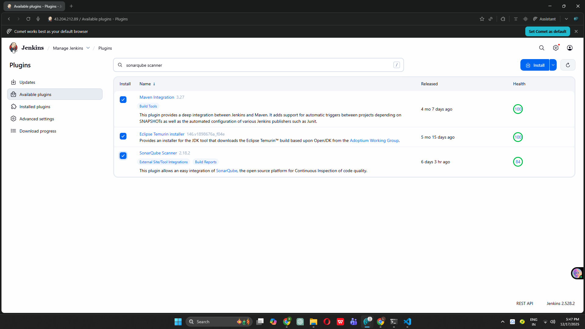
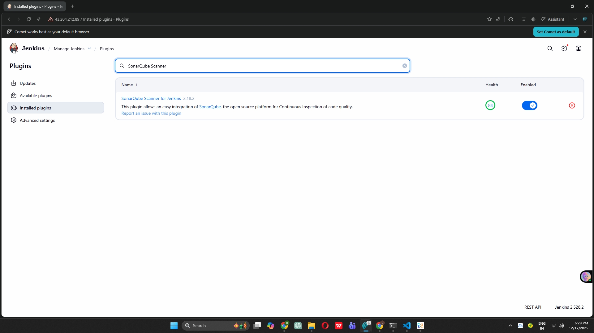
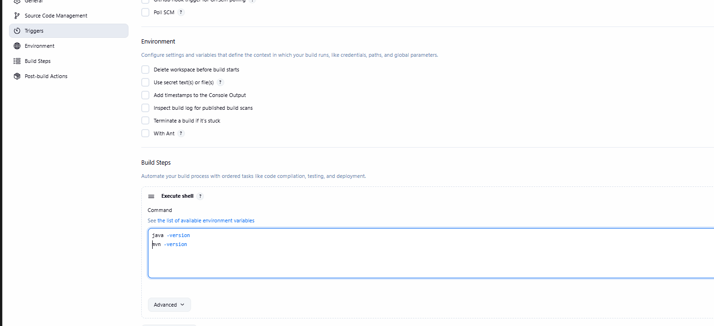

# Complete DevOps CI/CD Project - Board Game Application

## 🚀 Project Status: Phase 6 Completed

This repository documents my journey building a complete DevOps CI/CD pipeline from scratch as a beginner.

---

## 📋 Project Overview

Building an end-to-end DevOps pipeline for a Board Game Database application with the following tools:
- **Infrastructure**: AWS, Terraform
- **Configuration Management**: Ansible
- **CI/CD**: Jenkins
- **Code Quality**: SonarQube
- **Security**: Trivy
- **Artifact Repository**: Nexus
- **Containerization**: Docker
- **Orchestration**: Kubernetes (EKS)
- **Monitoring**: Prometheus & Grafana

---

## ✅ Completed Phases

### Phase 1: Infrastructure Setup with Terraform
**Objective**: Automated AWS infrastructure provisioning

**Key Accomplishments:**
- Created IAM user with administrative access
- Configured AWS CLI with access credentials
- Wrote Terraform configuration files (`provider.tf`, `main.tf`)
- Generated SSH key pair for secure EC2 access
- Launched 2 EC2 instances (t2.medium) with 20GB storage
- Implemented infrastructure as code principles

**Skills Learned:**
- Terraform syntax and resource management
- AWS EC2 instance configuration
- SSH key pair generation and management
- Infrastructure automation

---

### Phase 2: Configuration Management with Ansible
**Objective**: Automated Docker installation across multiple servers

**Key Accomplishments:**
- Launched dedicated Ansible control server (t2.medium, Ubuntu)
- Created inventory file with target server details
- Configured SSH authentication with private keys
- Wrote Ansible playbook for Docker installation
- Successfully deployed Docker on all target servers
- Verified connectivity using Ansible ping module

**Skills Learned:**
- Ansible inventory management
- Playbook creation and execution
- SSH key-based authentication
- Automated configuration management
- YAML syntax for playbooks

---

### Phase 3: SonarQube Setup
**Objective**: Code quality analysis infrastructure

**Key Accomplishments:**
- Connected to SonarQube server instance
- Configured Docker permissions (`/var/run/docker.sock`)
- Pulled official SonarQube Docker image
- Created and exposed SonarQube container on port 9000
- Successfully accessed SonarQube web interface
- Configured initial admin credentials
- Prepared dashboard for code quality analysis

**Skills Learned:**
- Docker container management
- Port mapping and exposure
- Container networking basics
- SonarQube initial configuration

---

### Phase 4: Nexus Repository Setup
**Objective**: Artifact repository management

**Key Accomplishments:**
- Connected to Nexus server instance
- Configured Docker socket permissions
- Pulled Nexus3 Docker image from Sonatype
- Created Nexus container with port 8081 exposed
- Retrieved initial admin password from container
- Set up Nexus dashboard with custom credentials
- Prepared repository for Maven artifact storage

**Skills Learned:**
- Docker exec commands for container access
- Artifact repository concepts
- Nexus repository management
- Container file system navigation

---

### Phase 5: Jenkins CI/CD Server Configuration
**Objective**: Set up Jenkins for continuous integration and deployment

**Key Accomplishments:**
- Launched dedicated Jenkins EC2 instance (t2.medium, 15GB storage)
- Created automated installation script for Java 17 and Jenkins
- Configured Jenkins repository and GPG keys
- Successfully installed and started Jenkins service
- Enabled Jenkins to start on system boot
- Opened port 8080 in AWS security group
- Accessed Jenkins web interface
- Retrieved and used initial admin password
- Installed suggested Jenkins plugins
- Created first admin user
- Successfully logged into Jenkins dashboard

**Skills Learned:**
- Bash scripting for automation
- Linux service management (systemctl)
- File permissions and execution rights
- AWS security group configuration
- Jenkins initial setup and configuration
- Plugin management in Jenkins

---

### Phase 6: Jenkins Plugins and Tools Configuration ✨ **JUST COMPLETED**
**Objective**: Configure Jenkins with essential build tools and plugins

**Key Accomplishments:**
- Accessed Jenkins Plugin Manager successfully
- Installed Maven Integration plugin for build automation
- Installed Eclipse Temurin installer plugin for JDK management
- Installed SonarQube Scanner plugin for code quality integration
- Configured Jenkins to automatically restart after plugin installation
- Set up JDK 17 (OpenJDK) with automatic installation from Adoptium
- Configured SonarQube Scanner with latest version from Maven Central
- Configured Maven 3.x with automatic installation from Apache
- Verified all tool configurations in Global Tool Configuration
- Created and executed test job to validate tool installations
- Confirmed Java and Maven are correctly installed and accessible

**Skills Learned:**
- Jenkins plugin ecosystem and management
- Global Tool Configuration in Jenkins
- Automatic tool installation and versioning
- JDK configuration and management in CI/CD
- Maven integration with Jenkins
- SonarQube scanner setup
- Creating and testing Jenkins freestyle jobs
- Reading and interpreting Jenkins console output
- Build environment configuration

**Technical Details:**
- **JDK Version**: OpenJDK 17 (latest from Adoptium)
- **Maven Version**: 3.9.x (latest stable)
- **SonarQube Scanner**: Latest from Maven Central
- **Installation Method**: Automatic download and installation
- **Tool Names** (for pipeline reference):
  - JDK: `jdk-17`
  - Maven: `maven`
  - SonarQube Scanner: `sonarqube-scanner`

---

## 📸 Screenshots - Phase 6

### Screenshot 1: Plugins Selected for Installation

*Maven Integration, Eclipse Temurin, and SonarQube Scanner plugins selected for installation*

### Screenshot 2: Plugin Installation Success

*All three plugins successfully downloaded and installed with Jenkins restart*

### Screenshot 3: Tools Configuration Page

*JDK 17, SonarQube Scanner, and Maven configured with automatic installation*

### Screenshot 4: Tool Installation Verification

*Console output showing successful Java and Maven version detection*

---

## 🛠️ Technical Architecture (Current State)

```
GitHub Repository (Source Code)
         ↓
    [JENKINS] ← Phase 6 Complete (Plugins & Tools Configured)
         ↓
   Tools Available:
   - JDK 17 ← Phase 6
   - Maven 3.x ← Phase 6
   - SonarQube Scanner ← Phase 6
         ↓
   Build & Test (Maven)
         ↓
    [SONARQUBE] ← Phase 3 Complete (Code Quality)
         ↓
  Security Scan (Trivy)
         ↓
    [NEXUS] ← Phase 4 Complete (Artifact Storage)
         ↓
  Docker Image Creation
         ↓
  Push to DockerHub
         ↓
  Deploy to EKS
         ↓
  Monitoring (Prometheus & Grafana)
```

---

## 🎯 What's Working Now

### Jenkins Build Environment Ready
- ✅ Java 17 (OpenJDK) automatically available
- ✅ Maven for compiling and packaging Java projects
- ✅ SonarQube Scanner for code quality analysis
- ✅ Plugins installed for enhanced functionality
- ✅ Tools configured for automatic installation

### Ready for Next Phase
With tools configured, we can now:
- Create Jenkins pipelines with proper tool declarations
- Compile Java code using Maven
- Run tests with Maven
- Analyze code quality with SonarQube
- Package applications as JAR/WAR files

---

## 🎯 Next Steps

### Upcoming Phases:
- **Phase 7**: Create Jenkins Pipeline (compile, test stages)
- **Phase 8**: Configure SonarQube integration with Jenkins
- **Phase 9**: Add Trivy security scanning to pipeline
- **Phase 10-13**: Package and deploy artifacts to Nexus
- **Phase 14-16**: Docker image creation and registry push
- **Phase 17-20**: Kubernetes (EKS) cluster deployment
- **Phase 21**: Email notifications and GitHub webhooks
- **Phase 22-25**: Monitoring with Prometheus and Grafana

---

## 💡 Key Learnings as a Beginner

### What I've Learned in Phase 6:

1. **Jenkins Plugin Ecosystem**
   - Jenkins extends functionality through plugins
   - Some plugins are pre-installed, others need manual installation
   - Plugin dependencies are automatically resolved
   - Plugins can be installed in batches for efficiency

2. **Tool Configuration in Jenkins**
   - Global Tool Configuration applies to all jobs
   - Tools can be automatically downloaded and installed
   - Tool names are referenced in pipeline scripts
   - Version management is handled by Jenkins

3. **Build Tool Integration**
   - Maven is the standard Java build tool
   - JDK version must match project requirements
   - SonarQube Scanner integrates code quality checks
   - Tools are downloaded on first use to save space

4. **Jenkins Best Practices**
   - Test configurations before using in production
   - Use consistent naming conventions for tools
   - Verify installations through test jobs
   - Document tool versions for reproducibility

### Challenges Overcome:
- Understanding the difference between plugins and tools
- Finding the correct plugin names in the marketplace
- Configuring automatic installation correctly
- Verifying tool installation without a full pipeline
- Learning to read Jenkins console output

---

## 📚 Resources Used

- [Jenkins Plugin Index](https://plugins.jenkins.io/)
- [Jenkins Documentation - Managing Tools](https://www.jenkins.io/doc/book/managing/tools/)
- [Maven Documentation](https://maven.apache.org/guides/)
- [Eclipse Adoptium](https://adoptium.net/)
- [SonarQube Scanner Documentation](https://docs.sonarqube.org/latest/analysis/scan/sonarscanner-for-jenkins/)

---

## 🔧 Current Infrastructure

### Active AWS Resources:
- **Jenkins Server**: t2.medium, 15GB, Ubuntu (Port 8080)
- **SonarQube Server**: t2.medium, 20GB, Ubuntu, Docker container (Port 9000)
- **Nexus Server**: t2.medium, 20GB, Ubuntu, Docker container (Port 8081)
- **Ansible Server**: t2.medium, 8GB, Ubuntu
- **Total EC2 Instances**: 4 instances running

### Tools Configured:
- **Java**: OpenJDK 17 (Temurin distribution)
- **Maven**: Version 3.9.x (latest stable)
- **SonarQube Scanner**: Latest from Maven Central
- **Jenkins Plugins**: 3 additional plugins installed

---

## 📊 Project Progress Metrics

**Overall Progress**: 6/25 Phases Complete (24%)

**Time Invested**: 
- Phase 1: Infrastructure setup
- Phase 2: Ansible automation
- Phase 3: SonarQube setup
- Phase 4: Nexus repository
- Phase 5: Jenkins installation
- Phase 6: Tools configuration ← Current

**Estimated Completion**: Continuing with Phase 7 next

---

## 💻 Tool Reference for Future Phases

When creating Jenkins pipelines, use these exact tool names:

```groovy
tools {
    jdk 'jdk-17'           // Java Development Kit
    maven 'maven'          // Maven build tool
}
```

For SonarQube Scanner, reference: `sonarqube-scanner`

---

## 🙏 Acknowledgments

Thanks to the Jenkins community for comprehensive plugin documentation and the Adoptium project for providing reliable OpenJDK distributions.

 