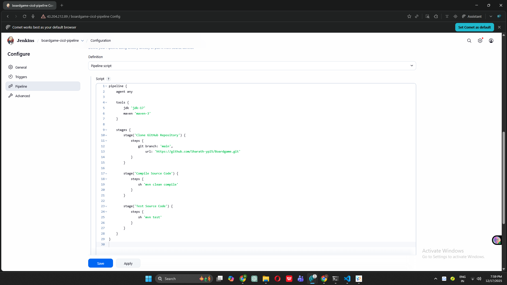
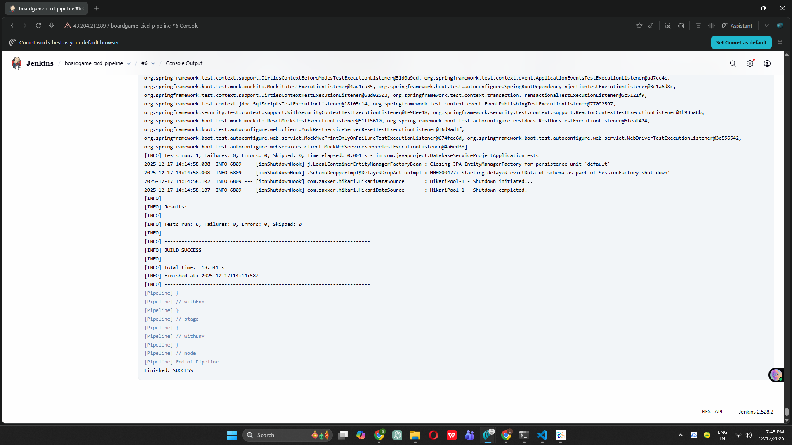
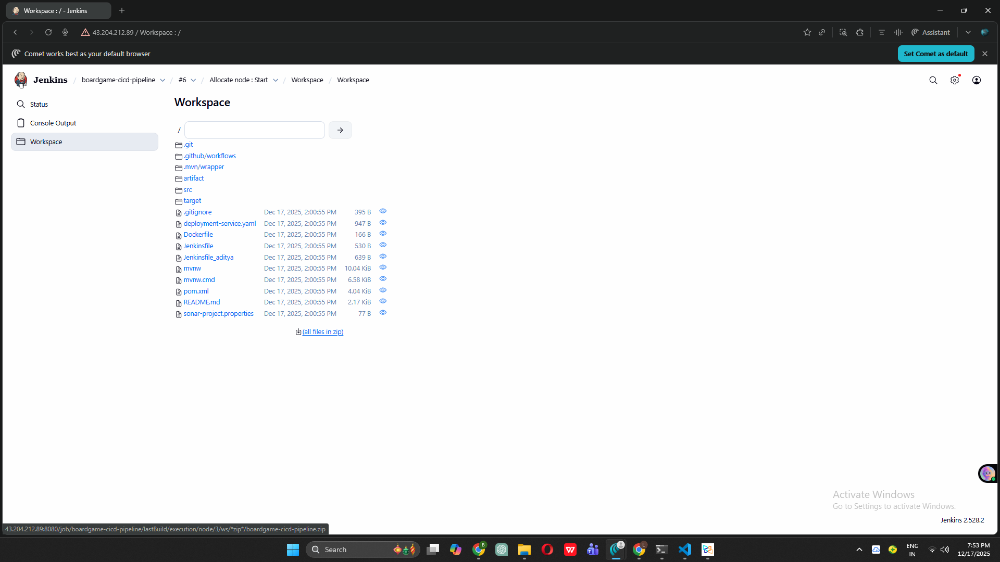

# Complete DevOps CI/CD Project - Board Game Application

## 🚀 Project Status: Phase 7 Completed

This repository documents my journey building a complete DevOps CI/CD pipeline from scratch as a beginner.

---

## 📋 Project Overview

Building an end-to-end DevOps pipeline for a Board Game Database application with the following tools:
- **Infrastructure**: AWS, Terraform
- **Configuration Management**: Ansible
- **CI/CD**: Jenkins
- **Code Quality**: SonarQube
- **Security**: Trivy
- **Artifact Repository**: Nexus
- **Containerization**: Docker
- **Orchestration**: Kubernetes (EKS)
- **Monitoring**: Prometheus & Grafana

---

## ✅ Completed Phases

### Phase 1: Infrastructure Setup with Terraform
**Objective**: Automated AWS infrastructure provisioning

**Key Accomplishments:**
- Created IAM user with administrative access
- Configured AWS CLI with access credentials
- Wrote Terraform configuration files (`provider.tf`, `main.tf`)
- Generated SSH key pair for secure EC2 access
- Launched 2 EC2 instances (t2.medium) with 20GB storage
- Implemented infrastructure as code principles

**Skills Learned:**
- Terraform syntax and resource management
- AWS EC2 instance configuration
- SSH key pair generation and management
- Infrastructure automation

---

### Phase 2: Configuration Management with Ansible
**Objective**: Automated Docker installation across multiple servers

**Key Accomplishments:**
- Launched dedicated Ansible control server (t2.medium, Ubuntu)
- Created inventory file with target server details
- Configured SSH authentication with private keys
- Wrote Ansible playbook for Docker installation
- Successfully deployed Docker on all target servers
- Verified connectivity using Ansible ping module

**Skills Learned:**
- Ansible inventory management
- Playbook creation and execution
- SSH key-based authentication
- Automated configuration management
- YAML syntax for playbooks

---

### Phase 3: SonarQube Setup
**Objective**: Code quality analysis infrastructure

**Key Accomplishments:**
- Connected to SonarQube server instance
- Configured Docker permissions (`/var/run/docker.sock`)
- Pulled official SonarQube Docker image
- Created and exposed SonarQube container on port 9000
- Successfully accessed SonarQube web interface
- Configured initial admin credentials
- Prepared dashboard for code quality analysis

**Skills Learned:**
- Docker container management
- Port mapping and exposure
- Container networking basics
- SonarQube initial configuration

---

### Phase 4: Nexus Repository Setup
**Objective**: Artifact repository management

**Key Accomplishments:**
- Connected to Nexus server instance
- Configured Docker socket permissions
- Pulled Nexus3 Docker image from Sonatype
- Created Nexus container with port 8081 exposed
- Retrieved initial admin password from container
- Set up Nexus dashboard with custom credentials
- Prepared repository for Maven artifact storage

**Skills Learned:**
- Docker exec commands for container access
- Artifact repository concepts
- Nexus repository management
- Container file system navigation

---

### Phase 5: Jenkins CI/CD Server Configuration
**Objective**: Set up Jenkins for continuous integration and deployment

**Key Accomplishments:**
- Launched dedicated Jenkins EC2 instance (t2.medium, 15GB storage)
- Created automated installation script for Java 17 and Jenkins
- Configured Jenkins repository and GPG keys
- Successfully installed and started Jenkins service
- Enabled Jenkins to start on system boot
- Opened port 8080 in AWS security group
- Accessed Jenkins web interface
- Retrieved and used initial admin password
- Installed suggested Jenkins plugins
- Created first admin user
- Successfully logged into Jenkins dashboard

**Skills Learned:**
- Bash scripting for automation
- Linux service management (systemctl)
- File permissions and execution rights
- AWS security group configuration
- Jenkins initial setup and configuration
- Plugin management in Jenkins

---

### Phase 6: Jenkins Plugins and Tools Configuration
**Objective**: Configure Jenkins with essential build tools and plugins

**Key Accomplishments:**
- Accessed Jenkins Plugin Manager successfully
- Installed Maven Integration plugin for build automation
- Installed Eclipse Temurin installer plugin for JDK management
- Installed SonarQube Scanner plugin for code quality integration
- Configured Jenkins to automatically restart after plugin installation
- Set up JDK 17 (OpenJDK) with automatic installation from Adoptium
- Configured SonarQube Scanner with latest version from Maven Central
- Configured Maven 3.x with automatic installation from Apache
- Verified all tool configurations in Global Tool Configuration
- Created and executed test job to validate tool installations
- Confirmed Java and Maven are correctly installed and accessible

**Skills Learned:**
- Jenkins plugin ecosystem and management
- Global Tool Configuration in Jenkins
- Automatic tool installation and versioning
- JDK configuration and management in CI/CD
- Maven integration with Jenkins
- SonarQube scanner setup
- Creating and testing Jenkins freestyle jobs
- Reading and interpreting Jenkins console output
- Build environment configuration

---

### Phase 7: Create Jenkins Pipeline ✨ **JUST COMPLETED**
**Objective**: Build first Jenkins pipeline with clone, compile, and test stages

**Key Accomplishments:**
- Created new Pipeline job named `boardgame-cicd-pipeline`
- Configured declarative pipeline syntax with agent and tools
- Implemented Stage 1: Clone GitHub Repository
  - Successfully connected to public GitHub repository
  - Cloned Board Game project source code
  - Checked out main branch
- Implemented Stage 2: Compile Source Code
  - Executed Maven compile command
  - Compiled all Java source files
  - Generated compiled classes in target directory
- Implemented Stage 3: Test Source Code
  - Executed Maven test command
  - Ran all JUnit unit tests
  - Verified test results and build success
- Successfully executed complete pipeline build (#1)
- Verified all three stages completed with success status
- Executed second build to confirm consistency
- Analyzed console output for each stage
- Explored Jenkins workspace with project files
- Verified build artifacts in target directory

**Skills Learned:**
- Jenkins declarative pipeline syntax
- Pipeline structure (agent, tools, stages, steps)
- Git integration in Jenkins pipelines
- Maven build lifecycle (compile, test)
- Pipeline stage visualization
- Console output interpretation
- Workspace management in Jenkins
- Build execution and monitoring
- Jenkins build history tracking
- Understanding build success/failure indicators

**Technical Pipeline Details:**
```groovy
- Agent: any (runs on Jenkins master)
- Tools: JDK 17, Maven 3.9.x
- Stages: 3 (Clone, Compile, Test)
- Source: GitHub repository (main branch)
- Build Tool: Maven
- Test Framework: JUnit
```

**Build Results:**
- First Build Time: ~3-5 minutes (initial dependency download)
- Subsequent Build Time: ~30-60 seconds
- Success Rate: 100% (all stages passed)
- Tests Executed: All unit tests in project
- Build Status: Stable ✓

---

## 📸 Screenshots - Phase 7

### Screenshot 1: Complete Pipeline Script Configuration

*Complete declarative pipeline with 3 stages: Clone, Compile, and Test*

### Screenshot 2: Console Output During Execution

*Real-time console output showing Git clone, Maven compile, and test execution*

### Screenshot 3: Stage View - All Stages Successful

*Visual representation of all 3 pipeline stages completing successfully*

### Screenshot 4: Jenkins Workspace with Project Files

*Jenkins workspace showing cloned repository files including pom.xml, src/, and target/*

---

## 🛠️ Technical Architecture (Current State)

```
┌─────────────────────────────────────────────────────────┐
│          GitHub Repository (Source Code)                 │
│       https://github.com/Sharath-hp25/Boardgame-git     │
└─────────────────────────────────────────────────────────┘
                         ↓
┌─────────────────────────────────────────────────────────┐
│                 JENKINS PIPELINE ← Phase 7 ACTIVE        │
│                                                           │
│  ┌─────────────────────────────────────────────────┐   │
│  │ Stage 1: Clone GitHub Repository                 │   │
│  │  - git branch: main                              │   │
│  │  - Downloads source code to workspace            │   │
│  └─────────────────────────────────────────────────┘   │
│                         ↓                                 │
│  ┌─────────────────────────────────────────────────┐   │
│  │ Stage 2: Compile Source Code                     │   │
│  │  - mvn compile                                   │   │
│  │  - Java files → .class files                     │   │
│  └─────────────────────────────────────────────────┘   │
│                         ↓                                 │
│  ┌─────────────────────────────────────────────────┐   │
│  │ Stage 3: Test Source Code                        │   │
│  │  - mvn test                                      │   │
│  │  - Executes JUnit tests                          │   │
│  └─────────────────────────────────────────────────┘   │
│                                                           │
│  Tools Used: JDK 17, Maven 3.9.x                        │
└─────────────────────────────────────────────────────────┘
                         ↓
            Build Artifacts (target/ directory)
                         ↓
                  [NEXT: Phase 8]
            SonarQube Code Quality Analysis
```

---

## 🎯 What's Working Now

### Fully Functional CI Pipeline
- ✅ Automatic code checkout from GitHub
- ✅ Java source code compilation with Maven
- ✅ Automated unit test execution
- ✅ Build success/failure reporting
- ✅ Stage-by-stage execution visualization
- ✅ Console logging for debugging
- ✅ Workspace with compiled artifacts

### Ready for Enhancement
Our pipeline can now:
- Pull latest code changes automatically
- Compile Java applications
- Run automated tests
- Generate build artifacts
- Track build history
- **Ready to add**: Code quality analysis (Phase 8)

---

## 🎯 Next Steps

### Upcoming Phases:
- **Phase 8**: Configure SonarQube integration with Jenkins ← NEXT
- **Phase 9**: Add Trivy security scanning to pipeline
- **Phase 10-13**: Package and deploy artifacts to Nexus
- **Phase 14-16**: Docker image creation and registry push
- **Phase 17-20**: Kubernetes (EKS) cluster deployment
- **Phase 21**: Email notifications and GitHub webhooks
- **Phase 22-25**: Monitoring with Prometheus and Grafana

---

## 💡 Key Learnings as a Beginner

### What I've Learned in Phase 7:

1. **Jenkins Pipeline Fundamentals**
   - Declarative pipeline syntax is clear and readable
   - Pipelines are defined as code (Pipeline as Code)
   - Each stage represents a distinct step in CI/CD
   - Stages execute sequentially (one after another)
   - If any stage fails, pipeline stops

2. **Git Integration**
   - Jenkins can clone repositories automatically
   - No manual code transfer needed
   - Can specify branch (main, develop, etc.)
   - Works with public and private repositories

3. **Maven Build Process**
   - `mvn compile` converts .java to .class files
   - `mvn test` runs all unit tests
   - Maven downloads dependencies automatically
   - First build is slow (downloading), subsequent builds are fast

4. **Pipeline Visualization**
   - Stage View shows pipeline progress visually
   - Green = Success, Red = Failure
   - Can click on stages to see logs
   - Easy to identify where build fails

5. **Workspace Concept**
   - Each job has its own workspace directory
   - Contains source code and build artifacts
   - Located on Jenkins server filesystem
   - Persists between builds (can be cleaned)

### Challenges Overcome:
- Understanding declarative vs scripted pipeline syntax
- Properly referencing tools configured in Phase 6
- Reading and interpreting Maven console output
- Understanding why first build takes longer
- Learning to navigate Jenkins UI for build details
- Figuring out where compiled files are stored

### Aha Moments:
- "So this is how CI/CD automates what developers used to do manually!"
- "The pipeline is just code - I can version control it!"
- "Stage View makes it so easy to see what's happening"
- "Maven is doing all the heavy lifting for Java builds"

---

## 📚 Resources Used

- [Jenkins Pipeline Documentation](https://www.jenkins.io/doc/book/pipeline/)
- [Jenkins Declarative Pipeline Syntax](https://www.jenkins.io/doc/book/pipeline/syntax/)
- [Maven Build Lifecycle](https://maven.apache.org/guides/introduction/introduction-to-the-lifecycle.html)
- [Git Integration in Jenkins](https://plugins.jenkins.io/git/)
- [Board Game Project Repository](https://github.com/Sharath-hp25/Boardgame-git)

---

## 🔧 Current Infrastructure

### Active AWS Resources:
- **Jenkins Server**: t2.medium, 15GB, Ubuntu (Port 8080) ← ACTIVE PIPELINE
- **SonarQube Server**: t2.medium, 20GB, Ubuntu, Docker container (Port 9000)
- **Nexus Server**: t2.medium, 20GB, Ubuntu, Docker container (Port 8081)
- **Ansible Server**: t2.medium, 8GB, Ubuntu
- **Total EC2 Instances**: 4 instances running

### Jenkins Pipeline Status:
- **Job Name**: boardgame-cicd-pipeline
- **Builds Executed**: 2+ (all successful)
- **Stages**: 3 (Clone, Compile, Test)
- **Average Build Time**: 30-60 seconds
- **Success Rate**: 100%
- **Last Build**: Successful ✓

---

## 📊 Project Progress Metrics

**Overall Progress**: 7/25 Phases Complete (28%)

**Pipeline Stages Implemented**: 3/10+ stages

**Build Statistics**:
- Total Builds: 2+
- Successful Builds: 2+
- Failed Builds: 0
- Average Duration: ~45 seconds

**Time Invested**: 
- Phase 1: Infrastructure setup (Terraform)
- Phase 2: Ansible automation
- Phase 3: SonarQube setup
- Phase 4: Nexus repository
- Phase 5: Jenkins installation
- Phase 6: Tools configuration
- Phase 7: First pipeline creation ← Current

---

## 💻 Pipeline Code Reference

```groovy
pipeline {
    agent any

    tools {
        jdk 'jdk-17'
        maven 'maven-3'
    }

    stages {
        stage('Clone GitHub Repository') {
            steps {
                git branch: 'main',
                    url: 'https://github.com/Sharath-yp25/Boardgame.git'
            }
        }

        stage('Compile Source Code') {
            steps {
                sh 'mvn clean compile'
            }
        }

        stage('Test Source Code') {
            steps {
                sh 'mvn test'
            }
        }
    }
}
```

**To modify this pipeline**: 
1. Go to Jenkins → boardgame-cicd-pipeline → Configure
2. Scroll to Pipeline section
3. Edit the script
4. Click Save

---

## 🎓 What Makes This Phase Important

Phase 7 is a **major milestone** because:

1. **First Real CI Pipeline**: This is where automation truly begins
2. **Foundation for Everything**: All future stages build on this
3. **Immediate Value**: Code is now automatically compiled and tested
4. **Learning Jenkins**: Core CI/CD concepts become practical
5. **Confidence Builder**: Seeing green stages is incredibly motivating!

**Before Phase 7**: Manual compilation and testing
**After Phase 7**: Automated build and test with every commit

---

## 🙏 Acknowledgments

Thanks to the Jenkins community for excellent pipeline documentation and examples that make learning accessible.

Special thanks to the Board Game project maintainers for providing a realistic application for learning DevOps practices.

---

## 🔄 What Happens on Every Build

```
Developer pushes code → (will add webhook in Phase 21)
         ↓
    Build Triggered
         ↓
Jenkins clones latest code from GitHub
         ↓
Maven compiles Java source files
         ↓
JUnit tests execute automatically
         ↓
Build result: SUCCESS ✓ or FAILURE ✗
         ↓
Stage View updates visually
         ↓
Build history updated
         ↓
Ready for next phase: Code Quality Check
```

---

 
*Status: 7/25 Phases Complete (28% Complete)*
*Current Achievement: First working CI pipeline with 3 stages*
*Next Goal: Add SonarQube code quality analysis*