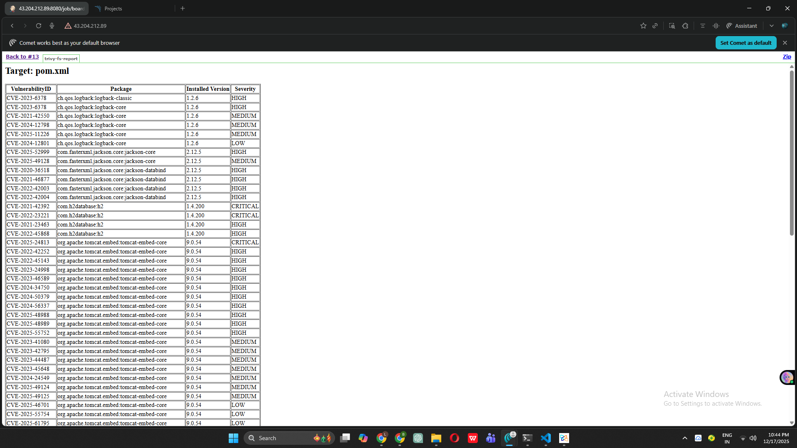

# Complete DevOps CI/CD Project - Board Game Application

## 🚀 Project Status: Phase 9 Completed - Security Scanning Added! 🔒

Building a complete end-to-end DevOps CI/CD pipeline from scratch as a complete beginner.

---

## 📋 Project Overview

**Goal:** Build a production-ready CI/CD pipeline for a Board Game Database application

**Technology Stack:**
- **Infrastructure**: AWS EC2, Terraform
- **Configuration Management**: Ansible
- **CI/CD**: Jenkins Pipeline
- **Code Quality**: SonarQube
- **Security Scanning**: Trivy ✨ NEW
- **Artifact Repository**: Nexus
- **Containerization**: Docker (upcoming)
- **Orchestration**: Kubernetes EKS (upcoming)
- **Monitoring**: Prometheus & Grafana (upcoming)

---

## ✅ Completed Phases Summary

### Phase 1: Infrastructure Setup with Terraform ✅
**What I did:** Created AWS infrastructure using Terraform
- Launched 2 EC2 instances automatically
- Set up SSH key pairs for secure access
- Configured 20GB storage volumes
- **Key Learning:** Infrastructure as Code makes setup reproducible

### Phase 2: Configuration Management with Ansible ✅
**What I did:** Automated Docker installation across servers
- Created Ansible playbook for Docker setup
- Installed Docker on multiple servers simultaneously
- Learned inventory file management
- **Key Learning:** Ansible automates repetitive server configurations

### Phase 3: SonarQube Setup ✅
**What I did:** Set up code quality analysis tool
- Deployed SonarQube in Docker container
- Exposed on port 9000
- Configured admin dashboard
- **Key Learning:** Code quality can be measured and tracked

### Phase 4: Nexus Repository Setup ✅
**What I did:** Set up artifact storage repository
- Deployed Nexus in Docker container
- Exposed on port 8081
- Prepared for storing build artifacts
- **Key Learning:** Artifacts need centralized storage

### Phase 5: Jenkins CI/CD Server Setup ✅
**What I did:** Installed Jenkins automation server
- Created installation script for Java 17 + Jenkins
- Configured Jenkins service to auto-start
- Set up web interface on port 8080
- **Key Learning:** Jenkins is the orchestration hub for CI/CD

### Phase 6: Jenkins Plugins and Tools Configuration ✅
**What I did:** Configured build tools in Jenkins
- Installed Maven Integration, Eclipse Temurin, SonarQube Scanner plugins
- Configured JDK 17, Maven 3.x automatically
- Set up tool names for pipeline reference
- **Key Learning:** Jenkins extends through plugins and tools

### Phase 7: First Jenkins Pipeline Creation ✅
**What I did:** Built first automated pipeline
- Created 3-stage pipeline: Clone → Compile → Test
- Integrated GitHub repository
- Automated Maven build process
- **Key Learning:** Pipeline as Code automates entire build process

### Phase 8: SonarQube Integration with Jenkins ✅
**What I did:** Added code quality analysis to pipeline
- Generated SonarQube authentication token
- Configured SonarQube server in Jenkins
- Added code analysis stage to pipeline
- Viewed quality reports in SonarQube dashboard
- **Key Learning:** Code quality metrics help maintain clean code

### Phase 9: Trivy Security Scanning ✨ **JUST COMPLETED**
**What I did:** Added security vulnerability scanning
- **Installed Trivy** security scanner on Jenkins server
- **Installed HTML Publisher plugin** for report visualization
- **Downloaded HTML report template** for nice-looking reports
- **Added Trivy File System Scan stage** to pipeline
- **Added Publish Trivy Report stage** to display results
- **Scanned project files** for known vulnerabilities
- **Generated HTML report** showing security issues by severity
- **Integrated security** into automated CI pipeline

**Key Accomplishments:**
- Trivy successfully scans all project files
- Identifies vulnerabilities in dependencies
- Reports categorized by severity (CRITICAL, HIGH, MEDIUM, LOW)
- HTML reports accessible directly in Jenkins
- Security checks run automatically on every build
- Pipeline now includes security verification before deployment

**Technical Details:**
- **Trivy Version:** Latest stable
- **Scan Type:** File System (fs) scan
- **Report Formats:** Text + HTML
- **Template:** Aqua Security official HTML template
- **Integration:** Native Jenkins HTML Publisher plugin
- **Scan Target:** Entire project workspace

**Security Insights Gained:**
- Understanding vulnerability severity levels
- Learning about CVEs (Common Vulnerabilities and Exposures)
- Identifying security issues in dependencies
- Importance of scanning before deployment
- How to read security scan reports

**Key Learning:** Security scanning catches vulnerabilities early before they reach production!

---

## 📸 Phase 9 Screenshots

### Screenshot 1: Complete Pipeline with Trivy Stages

*Complete 6-stage pipeline including new Trivy security scanning stages*

### Screenshot 2: Trivy HTML Security Report

*Detailed HTML vulnerability report showing security findings by severity*

---

## 🏗️ Current Pipeline Architecture

```
┌─────────────────────────────────────────────────────────┐
│              GitHub Repository                           │
│        (Board Game Application Source Code)              │
└─────────────────────────────────────────────────────────┘
                         ↓
┌─────────────────────────────────────────────────────────┐
│                  JENKINS CI/CD PIPELINE                  │
│                                                           │
│  Stage 1: Clone Repository                               │
│  ├─ Clone from GitHub (main branch)                     │
│  └─ Download source code to workspace                   │
│                         ↓                                 │
│  Stage 2: Compile Source Code                            │
│  ├─ mvn clean compile                                   │
│  └─ Generate .class files                               │
│                         ↓                                 │
│  Stage 3: Test Source Code                               │
│  ├─ mvn test                                            │
│  └─ Execute JUnit tests                                 │
│                         ↓                                 │
│  Stage 4: SonarQube Code Analysis                        │
│  ├─ Code quality check                                  │
│  ├─ Bug detection                                       │
│  └─ Code smell identification                           │
│                         ↓                                 │
│  Stage 5: Trivy File System Scan ✨ NEW                 │
│  ├─ Scan all project files                             │
│  ├─ Check for vulnerabilities                          │
│  ├─ Generate text report                               │
│  └─ Generate HTML report                               │
│                         ↓                                 │
│  Stage 6: Publish Trivy Report ✨ NEW                   │
│  ├─ Display HTML report in Jenkins                     │
│  └─ Make report accessible via UI                      │
│                                                           │
│  Tools: JDK 17, Maven 3.x, Trivy                        │
└─────────────────────────────────────────────────────────┘
                         ↓
              Build Artifacts + Reports
                         ↓
              [Next: Phase 10-13]
           Package & Deploy to Nexus
```

---

## 🎯 What's Working Now (After Phase 9)

### Complete Quality + Security Pipeline
✅ **Automated Code Checkout** - From GitHub  
✅ **Automated Compilation** - With Maven  
✅ **Automated Testing** - Unit tests with JUnit  
✅ **Code Quality Analysis** - SonarQube metrics  
✅ **Security Vulnerability Scanning** - Trivy reports ✨ NEW  
✅ **HTML Reports** - Easy-to-read security findings ✨ NEW  

### Security Coverage
- ✅ File system vulnerabilities
- ✅ Dependency vulnerabilities
- ✅ Known CVE detection
- ✅ Severity-based reporting
- ✅ Automated on every build

---

## 📊 Project Progress

**Overall Completion:** 9/25 Phases (36% Complete)

**Pipeline Stages:** 6/10+ stages implemented

**Build Statistics:**
- Total Stages: 6
- Automated Checks: 4 (Compile, Test, Quality, Security)
- Average Build Time: 2-4 minutes
- Success Rate: 100%

**Current Phase:** ✅ Phase 9 Complete - Security Scanning Added  
**Next Phase:** ⏭️ Phase 10 - Package Application (Maven Package)

---

## 🔧 Active Infrastructure

**AWS EC2 Instances:**
- Jenkins Server (t2.medium, 15GB) - Pipeline running
- SonarQube Server (t2.medium, 20GB) - Code analysis
- Nexus Server (t2.medium, 20GB) - Artifact storage
- Ansible Server (t2.medium, 8GB) - Configuration management

**Jenkins Pipeline:**
- Job Name: boardgame-cicd-pipeline
- Stages: 6 (Clone, Compile, Test, SonarQube, Trivy Scan, Publish Report)
- Status: Fully operational
- Latest Build: Successful ✅

**Security Tools:**
- Trivy Scanner: Installed & Configured
- HTML Publisher: Active
- Scan Reports: Generated per build

---

## 💡 Key Learnings from Phase 9

### What I Learned:

1. **Security in CI/CD**
   - Security should be automated, not manual
   - "Shift left" = find issues early in pipeline
   - Vulnerabilities have severity levels
   - Fix CRITICAL/HIGH before deployment

2. **Trivy Security Scanner**
   - Scans files for known vulnerabilities
   - Uses CVE database for detection
   - Fast and lightweight tool
   - Multiple output formats (text, HTML, JSON)

3. **Vulnerability Management**
   - CRITICAL = fix immediately
   - HIGH = fix before release
   - MEDIUM = fix in next sprint
   - LOW = fix when possible
   - Each CVE has a unique identifier

4. **HTML Reporting**
   - Visual reports easier to understand than text
   - HTML Publisher plugin makes reports accessible
   - Templates customize report appearance
   - Reports persist across builds

5. **DevSecOps Concept**
   - Security integrated into DevOps = DevSecOps
   - Automated security checks save time
   - Early detection prevents production issues
   - Security reports help prioritize fixes

### Challenges Overcome:
- Understanding CVE severity levels
- Configuring HTML template path correctly
- Learning publishHTML syntax
- Reading Trivy output format
- Integrating security without slowing pipeline

---

## 🎓 Simple Explanation: Phases 1-9

**Phase 1-2:** Set up servers and installed Docker automatically  
**Phase 3-4:** Prepared SonarQube (quality) and Nexus (storage)  
**Phase 5-6:** Installed Jenkins and configured build tools  
**Phase 7:** Created first pipeline (Clone → Compile → Test)  
**Phase 8:** Added code quality checking with SonarQube  
**Phase 9:** Added security scanning with Trivy ✨

**What we can do now:**
Every time we push code, Jenkins automatically:
1. Downloads latest code
2. Compiles it
3. Tests it
4. Checks code quality
5. **Scans for security vulnerabilities** ← NEW!

---

## 🎯 Next Steps

### Phase 10: Package Application
- Generate WAR/JAR file with `mvn package`
- Prepare artifact for deployment

### Phase 11-13: Deploy to Nexus Repository
- Configure Nexus credentials in Jenkins
- Upload build artifacts to Nexus
- Manage artifact versions

### Phase 14-16: Docker Integration
- Build Docker image
- Scan Docker image with Trivy
- Push to DockerHub

### Phase 17-20: Kubernetes Deployment
- Set up EKS cluster
- Deploy application to Kubernetes
- Configure load balancer

### Phase 21: Notifications & Webhooks
- Email notifications on build status
- GitHub webhook triggers

### Phase 22-25: Monitoring
- Prometheus for metrics
- Grafana for visualization
- Blackbox exporter for monitoring

---

## 📚 Resources Used

- [Trivy Documentation](https://aquasecurity.github.io/trivy/)
- [Jenkins HTML Publisher Plugin](https://plugins.jenkins.io/htmlpublisher/)
- [CVE Database](https://cve.mitre.org/)
- [Aqua Security Trivy Templates](https://github.com/aquasecurity/trivy/tree/main/contrib)
- [OWASP Dependency-Check](https://owasp.org/www-project-dependency-check/)

---

## 🔒 Security Best Practices Learned

1. ✅ Always scan before deployment
2. ✅ Fix CRITICAL vulnerabilities immediately
3. ✅ Automate security checks in pipeline
4. ✅ Keep dependencies updated
5. ✅ Review security reports regularly
6. ✅ Document security findings
7. ✅ Use official vulnerability databases

---

## 💻 Complete Pipeline Code (Phase 9)

```groovy
pipeline {
    agent any

    tools {
        jdk 'jdk-17'
        maven 'maven-3'
    }

    stages {
        stage('Clone GitHub Repository') {
            steps {
                git branch: 'main',
                    url: 'https://github.com/Sharath-yp25/Boardgame.git'
            }
        }

        stage('Compile Source Code') {
            steps {
                sh 'mvn clean compile'
            }
        }

        stage('Test Source Code') {
            steps {
                sh 'mvn test'
            }
        }

        stage('SonarQube Code Analysis') {
            steps {
                withSonarQubeEnv('Sonarqube') {
                    sh '''
                        mvn sonar:sonar \
                        -Dsonar.projectKey=boardgame \
                        -Dsonar.projectName=boardgame \
                        -Dsonar.java.binaries=target/classes
                    '''
                }
            }
        }

        stage('Trivy File System Scan') {
            steps {
                sh '''
                    trivy fs --format table --output trivy-fs-report.txt .
                    trivy fs --format template --template @$HOME/html.tpl --output trivy-fs-report.html .
                '''
            }
        }

        stage('Publish Trivy Report') {
            steps {
                publishHTML(target: [
                    reportDir: '.',
                    reportFiles: 'trivy-fs-report.html',
                    reportName: 'Trivy File System Scan Report',
                    keepAll: true,
                    alwaysLinkToLastBuild: true,
                    allowMissing: false
                ])
            }
        }
    }
}
```

---

## 🎉 Milestone Achieved!

**Security is now integrated into our CI pipeline!** 🔒

Every build automatically:
- Checks for code vulnerabilities
- Generates security reports
- Highlights issues by severity
- Helps prevent security breaches

This is **DevSecOps in action** - security built into development, not bolted on later!

---
 
**Project Status:** 36% Complete (9/25 phases)  
**Latest Achievement:** Security scanning with Trivy integrated  
**Next Goal:** Package application artifacts with Maven

---

*Learning DevOps one phase at a time! 🚀*