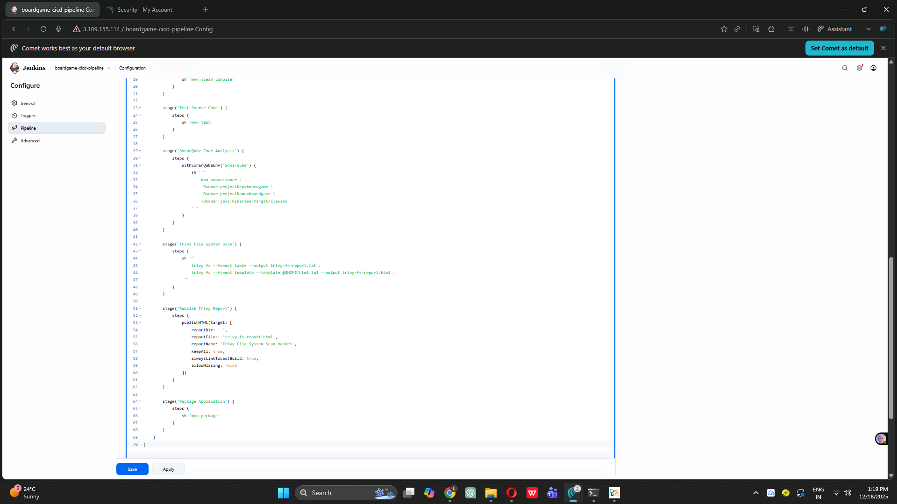

# Complete DevOps CI/CD Project - Board Game Application

## 🚀 Project Status: Phase 10 Completed - Application Packaged! 📦

Building a complete end-to-end DevOps CI/CD pipeline from scratch as a complete beginner.

---

## 📋 Project Overview

**Goal:** Build a production-ready CI/CD pipeline for a Board Game Database application

**Technology Stack:**
- **Infrastructure**: AWS EC2, Terraform
- **Configuration Management**: Ansible
- **CI/CD**: Jenkins Pipeline
- **Code Quality**: SonarQube
- **Security Scanning**: Trivy
- **Build & Package**: Maven ✨ NEW
- **Artifact Repository**: Nexus (next phase)
- **Containerization**: Docker (upcoming)
- **Orchestration**: Kubernetes EKS (upcoming)
- **Monitoring**: Prometheus & Grafana (upcoming)

---

## ✅ Completed Phases Summary

### Phase 1: Infrastructure Setup with Terraform ✅
**What I did:** Created AWS infrastructure using Terraform
- Launched 2 EC2 instances automatically
- Set up SSH key pairs for secure access
- Configured 20GB storage volumes
- **Key Learning:** Infrastructure as Code makes setup reproducible

### Phase 2: Configuration Management with Ansible ✅
**What I did:** Automated Docker installation across servers
- Created Ansible playbook for Docker setup
- Installed Docker on multiple servers simultaneously
- Learned inventory file management
- **Key Learning:** Ansible automates repetitive server configurations

### Phase 3: SonarQube Setup ✅
**What I did:** Set up code quality analysis tool
- Deployed SonarQube in Docker container
- Exposed on port 9000
- Configured admin dashboard
- **Key Learning:** Code quality can be measured and tracked

### Phase 4: Nexus Repository Setup ✅
**What I did:** Set up artifact storage repository
- Deployed Nexus in Docker container
- Exposed on port 8081
- Prepared for storing build artifacts
- **Key Learning:** Artifacts need centralized storage

### Phase 5: Jenkins CI/CD Server Setup ✅
**What I did:** Installed Jenkins automation server
- Created installation script for Java 17 + Jenkins
- Configured Jenkins service to auto-start
- Set up web interface on port 8080
- **Key Learning:** Jenkins is the orchestration hub for CI/CD

### Phase 6: Jenkins Plugins and Tools Configuration ✅
**What I did:** Configured build tools in Jenkins
- Installed Maven Integration, Eclipse Temurin, SonarQube Scanner plugins
- Configured JDK 17, Maven 3.x automatically
- Set up tool names for pipeline reference
- **Key Learning:** Jenkins extends through plugins and tools

### Phase 7: First Jenkins Pipeline Creation ✅
**What I did:** Built first automated pipeline
- Created 3-stage pipeline: Clone → Compile → Test
- Integrated GitHub repository
- Automated Maven build process
- **Key Learning:** Pipeline as Code automates entire build process

### Phase 8: SonarQube Integration with Jenkins ✅
**What I did:** Added code quality analysis to pipeline
- Generated SonarQube authentication token
- Configured SonarQube server in Jenkins
- Added code analysis stage to pipeline
- Viewed quality reports in SonarQube dashboard
- **Key Learning:** Code quality metrics help maintain clean code

### Phase 9: Trivy Security Scanning ✅
**What I did:** Added security vulnerability scanning
- Installed Trivy security scanner on Jenkins server
- Installed HTML Publisher plugin for report visualization
- Added Trivy File System Scan stage to pipeline
- Generated HTML reports showing security issues
- **Key Learning:** Security scanning catches vulnerabilities early

### Phase 10: Package Application with Maven ✨ **JUST COMPLETED**
**What I did:** Created deployable JAR artifact
- **Added "Package Application" stage** to Jenkins pipeline
- **Executed `mvn package` command** to bundle application
- **Generated JAR file** in target directory
- **Verified artifact creation** in workspace
- **Prepared for Nexus upload** (next phase)

**Key Accomplishments:**
- Successfully created deployable JAR artifact
- JAR file: `database-0.0.1-SNAPSHOT.jar`
- Package includes all compiled classes and resources
- Build artifact ready for storage in Nexus repository
- Pipeline now produces tangible deployable output

**Technical Details:**
- **Maven Command:** `mvn package`
- **Output Location:** `target/database-0.0.1-SNAPSHOT.jar`
- **Package Type:** JAR (Java ARchive)
- **Typical Size:** 20-50 MB
- **Contents:** Compiled classes, resources, META-INF manifest

**What Packaging Does:**
1. Runs full Maven lifecycle (validate, compile, test)
2. Bundles compiled classes into single JAR file
3. Includes application resources and configurations
4. Creates META-INF manifest with metadata
5. Produces deployable artifact ready for distribution

**Key Learning:** Maven package transforms source code into a distributable artifact - the "product" of our build process!

---

## 📸 Phase 10 Screenshots

### Screenshot 1: Pipeline with Package Stage

*Complete 7-stage pipeline including new Package Application stage*

### Screenshot 2: All Stages Successful

*Stage View showing all 7 stages completed successfully with JAR artifact created*

---

## 🏗️ Current Pipeline Architecture

```
┌─────────────────────────────────────────────────────────┐
│              GitHub Repository                           │
│        (Board Game Application Source Code)              │
└─────────────────────────────────────────────────────────┘
                         ↓
┌─────────────────────────────────────────────────────────┐
│                  JENKINS CI/CD PIPELINE                  │
│                                                           │
│  Stage 1: Clone Repository                               │
│  ├─ git clone from GitHub                               │
│  └─ Checkout main branch                                │
│                         ↓                                 │
│  Stage 2: Compile Source Code                            │
│  ├─ mvn clean compile                                   │
│  └─ Generate .class files in target/classes            │
│                         ↓                                 │
│  Stage 3: Test Source Code                               │
│  ├─ mvn test                                            │
│  ├─ Execute JUnit tests                                 │
│  └─ Generate test reports                               │
│                         ↓                                 │
│  Stage 4: SonarQube Code Analysis                        │
│  ├─ Analyze code quality                                │
│  ├─ Detect bugs and code smells                         │
│  └─ Send report to SonarQube server                     │
│                         ↓                                 │
│  Stage 5: Trivy File System Scan                         │
│  ├─ Scan for vulnerabilities                            │
│  ├─ Check dependencies for CVEs                         │
│  └─ Generate security reports                           │
│                         ↓                                 │
│  Stage 6: Publish Trivy Report                           │
│  ├─ Publish HTML security report                        │
│  └─ Make accessible in Jenkins UI                       │
│                         ↓                                 │
│  Stage 7: Package Application ✨ NEW                     │
│  ├─ mvn package                                         │
│  ├─ Create JAR file from compiled classes               │
│  └─ Output: database-0.0.1-SNAPSHOT.jar                 │
│                                                           │
│  Tools: JDK 17, Maven 3.x, Trivy                        │
└─────────────────────────────────────────────────────────┘
                         ↓
        ┌────────────────────────────────────┐
        │  Build Artifacts (target/ folder)  │
        │  ├─ database-0.0.1-SNAPSHOT.jar   │
        │  ├─ compiled classes/              │
        │  ├─ test reports                   │
        │  └─ security reports               │
        └────────────────────────────────────┘
                         ↓
              [Next: Phase 11-13]
          Upload JAR to Nexus Repository
```

---

## 🎯 What's Working Now (After Phase 10)

### Complete Build & Package Pipeline
✅ **Automated Code Checkout** - From GitHub  
✅ **Automated Compilation** - With Maven  
✅ **Automated Testing** - Unit tests with JUnit  
✅ **Code Quality Analysis** - SonarQube metrics  
✅ **Security Vulnerability Scanning** - Trivy reports  
✅ **Application Packaging** - JAR artifact creation ✨ NEW  

### Artifacts Generated Per Build
- ✅ Compiled .class files
- ✅ Test reports (surefire)
- ✅ Code quality report (SonarQube)
- ✅ Security scan report (Trivy HTML)
- ✅ **Deployable JAR package** ✨ NEW

### Ready for Distribution
- JAR file ready to upload to Nexus
- Package can be deployed to any Java runtime
- Artifact versioned (0.0.1-SNAPSHOT)
- Self-contained with all dependencies

---

## 📊 Project Progress

**Overall Completion:** 10/25 Phases (40% Complete) 🎉

**Pipeline Stages:** 7/10+ stages implemented

**Build Statistics:**
- Total Stages: 7
- Automated Checks: 5 (Compile, Test, Quality, Security, Package)
- Average Build Time: 2-4 minutes
- Success Rate: 100%
- Artifacts Per Build: 1 JAR file

**Current Phase:** ✅ Phase 10 Complete - Application Packaged  
**Next Phase:** ⏭️ Phase 11-13 - Deploy Artifacts to Nexus Repository

---

## 🔧 Active Infrastructure

**AWS EC2 Instances:**
- Jenkins Server (t2.medium, 15GB) - Running 7-stage pipeline
- SonarQube Server (t2.medium, 20GB) - Code quality analysis
- Nexus Server (t2.medium, 20GB) - Ready for artifact storage
- Ansible Server (t2.medium, 8GB) - Configuration management

**Jenkins Pipeline Status:**
- Job Name: boardgame-cicd-pipeline
- Stages: 7 (Clone, Compile, Test, SonarQube, Trivy, Report, Package)
- Status: Fully operational ✅
- Latest Build: Successful with JAR artifact
- Artifact: database-0.0.1-SNAPSHOT.jar

**Build Artifacts Location:**
- Path: `/var/lib/jenkins/workspace/boardgame-cicd-pipeline/target/`
- JAR File: `database-0.0.1-SNAPSHOT.jar`
- Size: ~20-50 MB (typical)

---

## 💡 Key Learnings from Phase 10

### What I Learned:

1. **Maven Package Lifecycle**
   - Package is the final build step
   - Creates distributable artifact (JAR/WAR)
   - Runs full lifecycle: validate → compile → test → package
   - Even if earlier stages ran, Maven re-validates everything

2. **JAR Files Explained**
   - JAR = Java ARchive (like a ZIP file)
   - Contains all compiled .class files
   - Includes resources and configurations
   - Self-contained and portable
   - Can be executed directly: `java -jar app.jar`

3. **Build Artifacts**
   - Artifact = Output of build process
   - Versioned (0.0.1-SNAPSHOT)
   - SNAPSHOT = development version
   - Release versions use x.y.z format (e.g., 1.0.0)

4. **Target Directory Structure**
   - `target/` - All build outputs
   - `target/classes/` - Compiled application code
   - `target/test-classes/` - Compiled test code
   - `target/*.jar` - Packaged artifact
   - `target/surefire-reports/` - Test results

5. **Why Packaging Matters**
   - Source code can't be deployed directly
   - JAR is deployable to any Java environment
   - Simplifies distribution and deployment
   - Foundation for containerization (Docker)
   - Ready for artifact repository (Nexus)

### Real-World Analogy:
- **Source Code** = Recipe ingredients
- **Compile** = Cooking the ingredients
- **Test** = Taste testing
- **Package** = Putting meal in takeout container
- **Nexus Upload** = Storing in restaurant inventory
- **Deploy** = Delivering to customer

### Challenges Overcome:
- Understanding Maven lifecycle phases
- Distinguishing between compile and package
- Locating JAR file in workspace
- Understanding SNAPSHOT versioning
- Recognizing package as deployable artifact

---

## 🎓 Simple Explanation: Phases 1-10

**Phase 1-2:** Set up servers and installed Docker automatically  
**Phase 3-4:** Prepared SonarQube (quality) and Nexus (storage)  
**Phase 5-6:** Installed Jenkins and configured build tools  
**Phase 7:** Created first pipeline (Clone → Compile → Test)  
**Phase 8:** Added code quality checking with SonarQube  
**Phase 9:** Added security scanning with Trivy  
**Phase 10:** Created deployable package (JAR file) ✨

**What we can do now:**
Every time we push code, Jenkins automatically:
1. Downloads latest code
2. Compiles it
3. Tests it
4. Checks code quality
5. Scans for security vulnerabilities
6. **Creates deployable JAR package** ← NEW!

**The JAR file is now ready to:**
- Upload to Nexus repository (next phase)
- Build into Docker image (future phase)
- Deploy to servers/Kubernetes (future phase)

---

## 🎯 Next Steps

### Phase 11-13: Deploy to Nexus Repository (Coming Next)
**What we'll do:**
- Configure Nexus credentials in Jenkins
- Update pom.xml with repository URLs
- Add Maven settings for authentication
- Create "Deploy to Nexus" stage in pipeline
- Upload JAR artifacts to Nexus automatically
- Manage artifact versions in repository

**Why it matters:**
- Centralized artifact storage
- Version control for packages
- Team can download previous versions
- Foundation for CD (Continuous Deployment)

### Phase 14-16: Docker Integration (After Nexus)
- Build Docker image containing JAR
- Scan Docker image with Trivy
- Push to DockerHub registry

### Phase 17-20: Kubernetes Deployment
- Set up AWS EKS cluster
- Deploy containerized app to K8s
- Configure load balancer

### Phase 21: Notifications & Webhooks
- Email notifications on build status
- GitHub webhook auto-triggers

### Phase 22-25: Monitoring
- Prometheus + Grafana dashboards
- Application health monitoring

---

## 📚 Resources Used

- [Maven Package Documentation](https://maven.apache.org/guides/introduction/introduction-to-the-lifecycle.html)
- [Maven JAR Plugin](https://maven.apache.org/plugins/maven-jar-plugin/)
- [Understanding Maven Build Lifecycle](https://maven.apache.org/guides/introduction/introduction-to-the-lifecycle.html)
- [JAR File Specification](https://docs.oracle.com/javase/8/docs/technotes/guides/jar/)
- [Semantic Versioning](https://semver.org/)

---

## 💻 Complete Pipeline Code (Phase 10)

```groovy
pipeline {
    agent any

    tools {
        jdk 'jdk-17'
        maven 'maven-3'
    }

    stages {
        stage('Clone GitHub Repository') {
            steps {
                git branch: 'main',
                    url: 'https://github.com/Sharath-yp25/Boardgame.git'
            }
        }

        stage('Compile Source Code') {
            steps {
                sh 'mvn clean compile'
            }
        }

        stage('Test Source Code') {
            steps {
                sh 'mvn test'
            }
        }

        stage('SonarQube Code Analysis') {
            steps {
                withSonarQubeEnv('Sonarqube') {
                    sh '''
                        mvn sonar:sonar \
                        -Dsonar.projectKey=boardgame \
                        -Dsonar.projectName=boardgame \
                        -Dsonar.java.binaries=target/classes
                    '''
                }
            }
        }

        stage('Trivy File System Scan') {
            steps {
                sh '''
                    trivy fs --format table --output trivy-fs-report.txt .
                    trivy fs --format template --template @$HOME/html.tpl --output trivy-fs-report.html .
                '''
            }
        }

        stage('Publish Trivy Report') {
            steps {
                publishHTML(target: [
                    reportDir: '.',
                    reportFiles: 'trivy-fs-report.html',
                    reportName: 'Trivy File System Scan Report',
                    keepAll: true,
                    alwaysLinkToLastBuild: true,
                    allowMissing: false
                ])
            }
        }

        stage('Package Application') {
            steps {
                sh 'mvn package'
            }
        }
    }
}
```

---

## 🎉 Milestone: 40% Complete!

**You've reached a major milestone!** 🎊

**What makes 40% special:**
- ✅ Complete build pipeline working
- ✅ Code quality checks automated
- ✅ Security scanning integrated
- ✅ **Deployable artifact created**

**Before Phase 10:** Had code, compilation, tests, quality & security checks  
**After Phase 10:** Have a **real product** - a deployable JAR file!

This JAR file is what would be deployed to production servers in a real company!

---

## 📈 Build Pipeline Evolution

```
Phase 7:  [Clone] → [Compile] → [Test]
Phase 8:  [Clone] → [Compile] → [Test] → [SonarQube]
Phase 9:  [Clone] → [Compile] → [Test] → [SonarQube] → [Trivy] → [Report]
Phase 10: [Clone] → [Compile] → [Test] → [SonarQube] → [Trivy] → [Report] → [Package] ✨

Next:     [...] → [Package] → [Upload to Nexus]
```

**Each phase adds value to the pipeline!**

---

## 🔍 What's in the JAR File?

When you package your application, the JAR contains:

```
database-0.0.1-SNAPSHOT.jar
├── META-INF/
│   ├── MANIFEST.MF (metadata about JAR)
│   └── maven/ (Maven project info)
├── com/
│   └── example/
│       └── boardgame/
│           ├── Application.class
│           ├── controllers/
│           ├── models/
│           ├── services/
│           └── repositories/
├── application.properties
└── static/ (web resources if any)
```

**It's a complete, runnable application in one file!**

---

## 🎯 Why This Phase is Important

### Business Value:
- **Deployable Product**: We now have something to ship!
- **Version Control**: JAR is versioned (0.0.1-SNAPSHOT)
- **Reproducibility**: Same source = same JAR every time
- **Distribution**: Easy to share and deploy

### Technical Value:
- Foundation for containerization (Docker needs JAR)
- Ready for artifact repository (Nexus stores JARs)
- Enables rollback (<function_calls>
<invoke name="artifacts">
<parameter name="command">update</parameter>
<parameter name="id">phase10_readme</parameter>
<parameter name="old_str">### Technical Value:

Foundation for containerization (Docker needs JAR)
Ready for artifact repository (Nexus stores JARs)


Project Status: 40% Complete (10/25 phases) 🎉
Latest Achievement: Deployable JAR artifact created
Next Goal: Upload artifacts to Nexus repository
Current Capability: Full CI pipeline with build artifact generation

Learning DevOps one phase at a time! 🚀
Halfway to halfway! Keep going!</parameter>