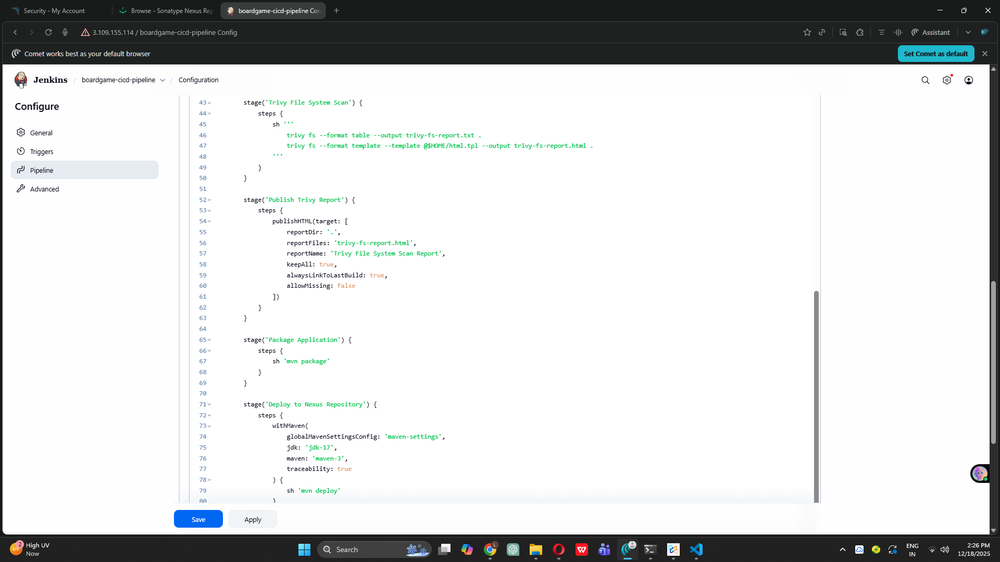

# Complete DevOps CI/CD Project - Board Game Application

## 🚀 Project Status: Phase 11 Completed - Artifacts Deployed to Nexus! 📦

Building a complete end-to-end DevOps CI/CD pipeline from scratch as a complete beginner.

---

## 📋 Project Overview

**Goal:** Build a production-ready CI/CD pipeline for a Board Game Database application

**Technology Stack:**
- **Infrastructure**: AWS EC2, Terraform
- **Configuration Management**: Ansible
- **CI/CD**: Jenkins Pipeline
- **Code Quality**: SonarQube
- **Security Scanning**: Trivy
- **Build & Package**: Maven
- **Artifact Repository**: Nexus Repository Manager ✨ ACTIVE
- **Containerization**: Docker (upcoming)
- **Orchestration**: Kubernetes EKS (upcoming)
- **Monitoring**: Prometheus & Grafana (upcoming)

---

## ✅ Completed Phases Summary

### Phase 1: Infrastructure Setup with Terraform ✅
**What I did:** Created AWS infrastructure using Terraform
- Launched 2 EC2 instances automatically
- Set up SSH key pairs for secure access
- Configured 20GB storage volumes
- **Key Learning:** Infrastructure as Code makes setup reproducible

### Phase 2: Configuration Management with Ansible ✅
**What I did:** Automated Docker installation across servers
- Created Ansible playbook for Docker setup
- Installed Docker on multiple servers simultaneously
- Learned inventory file management
- **Key Learning:** Ansible automates repetitive server configurations

### Phase 3: SonarQube Setup ✅
**What I did:** Set up code quality analysis tool
- Deployed SonarQube in Docker container
- Exposed on port 9000
- Configured admin dashboard
- **Key Learning:** Code quality can be measured and tracked

### Phase 4: Nexus Repository Setup ✅
**What I did:** Set up artifact storage repository
- Deployed Nexus in Docker container
- Exposed on port 8081
- Prepared for storing build artifacts
- **Key Learning:** Artifacts need centralized storage

### Phase 5: Jenkins CI/CD Server Setup ✅
**What I did:** Installed Jenkins automation server
- Created installation script for Java 17 + Jenkins
- Configured Jenkins service to auto-start
- Set up web interface on port 8080
- **Key Learning:** Jenkins is the orchestration hub for CI/CD

### Phase 6: Jenkins Plugins and Tools Configuration ✅
**What I did:** Configured build tools in Jenkins
- Installed Maven Integration, Eclipse Temurin, SonarQube Scanner plugins
- Configured JDK 17, Maven 3.x automatically
- Set up tool names for pipeline reference
- **Key Learning:** Jenkins extends through plugins and tools

### Phase 7: First Jenkins Pipeline Creation ✅
**What I did:** Built first automated pipeline
- Created 3-stage pipeline: Clone → Compile → Test
- Integrated GitHub repository
- Automated Maven build process
- **Key Learning:** Pipeline as Code automates entire build process

### Phase 8: SonarQube Integration with Jenkins ✅
**What I did:** Added code quality analysis to pipeline
- Generated SonarQube authentication token
- Configured SonarQube server in Jenkins
- Added code analysis stage to pipeline
- Viewed quality reports in SonarQube dashboard
- **Key Learning:** Code quality metrics help maintain clean code

### Phase 9: Trivy Security Scanning ✅
**What I did:** Added security vulnerability scanning
- Installed Trivy security scanner on Jenkins server
- Installed HTML Publisher plugin for report visualization
- Added Trivy File System Scan stage to pipeline
- Generated HTML reports showing security issues
- **Key Learning:** Security scanning catches vulnerabilities early

### Phase 10: Package Application with Maven ✅
**What I did:** Created deployable JAR artifact
- Added "Package Application" stage to Jenkins pipeline
- Executed `mvn package` command to bundle application
- Generated JAR file in target directory
- Verified artifact creation in workspace
- **Key Learning:** Maven package transforms code into distributable artifact

### Phase 11: Deploy Artifacts to Nexus Repository ✨ **JUST COMPLETED**
**What I did:** Uploaded JAR artifacts to centralized repository
- **Updated pom.xml** with Nexus repository URLs (distributionManagement)
- **Installed Jenkins plugins:** Nexus Artifact Uploader, Config File Provider, Pipeline Maven Integration
- **Created Maven settings file** with Nexus authentication credentials
- **Configured maven-releases** repository URL for production artifacts
- **Configured maven-snapshots** repository URL for development artifacts
- **Added "Deploy to Nexus" stage** to Jenkins pipeline
- **Successfully uploaded JAR** to Nexus maven-snapshots repository
- **Verified artifact storage** in Nexus web interface

**Key Accomplishments:**
- Artifacts automatically uploaded to Nexus on every build
- Version management now active (SNAPSHOT versioning)
- Team can download artifacts from centralized location
- Build artifacts persist beyond Jenkins workspace
- Foundation for artifact versioning and rollback capability

**Technical Details:**
- **Maven Command:** `mvn deploy`
- **Repository Type:** maven-snapshots (for SNAPSHOT versions)
- **Artifact Coordinates:** com.example:database:0.0.1-SNAPSHOT
- **Upload Location:** `http://<nexus-ip>:8081/repository/maven-snapshots/`
- **Authentication:** Stored in Jenkins managed settings.xml
- **Integration Method:** withMaven wrapper in pipeline

**What Deploy Does:**
1. Packages application (if not done)
2. Reads distributionManagement from pom.xml
3. Determines target repository (snapshots vs releases)
4. Authenticates using Maven settings.xml credentials
5. Uploads JAR file to Nexus
6. Uploads POM metadata
7. Updates repository index

**Key Learning:** Nexus provides centralized artifact management - the "warehouse" for build outputs that enables version control and artifact reuse!

---

## 📸 Phase 11 Screenshots

### Screenshot 1: Pipeline with Deploy to Nexus Stage

*Complete 8-stage pipeline including new Deploy to Nexus Repository stage*

### Screenshot 2: All Stages Successful with Nexus Deployment

*Stage View showing all 8 stages completed successfully with artifact uploaded to Nexus*

---

## 🏗️ Current Pipeline Architecture

```
┌─────────────────────────────────────────────────────────┐
│              GitHub Repository                           │
│        (Board Game Application Source Code)              │
└─────────────────────────────────────────────────────────┘
                         ↓
┌─────────────────────────────────────────────────────────┐
│                  JENKINS CI/CD PIPELINE                  │
│                                                           │
│  Stage 1: Clone Repository                               │
│  Stage 2: Compile Source Code                            │
│  Stage 3: Test Source Code                               │
│  Stage 4: SonarQube Code Analysis                        │
│  Stage 5: Trivy File System Scan                         │
│  Stage 6: Publish Trivy Report                           │
│  Stage 7: Package Application                            │
│  Stage 8: Deploy to Nexus Repository ✨ NEW             │
│                                                           │
│  Tools: JDK 17, Maven 3.x, Trivy                        │
└─────────────────────────────────────────────────────────┘
                         ↓
        ┌────────────────────────────────────┐
        │    NEXUS REPOSITORY MANAGER        │
        │    ✨ NOW RECEIVING ARTIFACTS      │
        │                                     │
        │  maven-snapshots/                  │
        │  └─ com/example/boardgame/         │
        │     └─ database/                   │
        │        └─ 0.0.1-SNAPSHOT/          │
        │           ├─ database-*.jar        │
        │           ├─ database-*.pom        │
        │           └─ maven-metadata.xml    │
        │                                     │
        │  Artifact Version: 0.0.1-SNAPSHOT  │
        │  Repository: maven-snapshots       │
        │  Status: Automatically uploaded    │
        └────────────────────────────────────┘
                         ↓
              [Next: Phase 14-16]
           Docker Image Creation & Push
```

---

## 🎯 What's Working Now (After Phase 11)

### Complete CI/CD Pipeline with Artifact Management
✅ **Automated Code Checkout** - From GitHub  
✅ **Automated Compilation** - With Maven  
✅ **Automated Testing** - Unit tests with JUnit  
✅ **Code Quality Analysis** - SonarQube metrics  
✅ **Security Vulnerability Scanning** - Trivy reports  
✅ **Application Packaging** - JAR artifact creation  
✅ **Centralized Artifact Storage** - Nexus repository ✨ NEW  

### Artifact Management Capabilities
- ✅ Automatic upload to Nexus on every build
- ✅ Version tracking (SNAPSHOT versioning)
- ✅ Artifact persistence (survives Jenkins workspace cleanup)
- ✅ Team-wide artifact access
- ✅ Download previous versions capability
- ✅ Metadata storage (POM files)

### What Each Build Produces Now
1. Compiled classes (target/classes)
2. Test reports (surefire-reports)
3. Code quality report (SonarQube)
4. Security scan report (Trivy HTML)
5. Deployable JAR package (target/*.jar)
6. **Nexus repository entry** ✨ NEW

---

## 📊 Project Progress

**Overall Completion:** 11/25 Phases (44% Complete) 🎉

**Pipeline Stages:** 8/10+ stages implemented

**Build Statistics:**
- Total Stages: 8
- Automated Checks: 5 (Compile, Test, Quality, Security, Package)
- Automated Deployments: 1 (Nexus upload)
- Average Build Time: 3-5 minutes
- Success Rate: 100%
- Artifacts Per Build: 1 JAR uploaded to Nexus

**Current Phase:** ✅ Phase 11 Complete - Nexus Integration Active  
**Next Phase:** ⏭️ Phase 14 - Docker Image Creation

---

## 🔧 Active Infrastructure

**AWS EC2 Instances:**
- Jenkins Server (t2.medium, 15GB) - Running 8-stage pipeline
- SonarQube Server (t2.medium, 20GB) - Code quality analysis
- Nexus Server (t2.medium, 20GB) - **NOW STORING ARTIFACTS** ✨
- Ansible Server (t2.medium, 8GB) - Configuration management

**Jenkins Pipeline Status:**
- Job Name: boardgame-cicd-pipeline
- Stages: 8 (Clone, Compile, Test, SonarQube, Trivy, Report, Package, Deploy)
- Status: Fully operational with Nexus integration ✅
- Latest Build: Successful with artifact uploaded
- Deployment Target: Nexus maven-snapshots repository

**Nexus Repository Status:**
- Active Repositories: maven-releases, maven-snapshots
- Stored Artifacts: database-0.0.1-SNAPSHOT.jar
- Upload Method: Maven deploy
- Authentication: Configured via Jenkins
- Access: Available to entire team

**Maven Configuration:**
- pom.xml: Updated with distributionManagement
- settings.xml: Configured in Jenkins with credentials
- Repositories: maven-releases, maven-snapshots
- Credentials: admin user (stored securely)

---

## 💡 Key Learnings from Phase 11

### What I Learned:

1. **Artifact Repository Concept**
   - Centralized storage for build outputs
   - Like GitHub for source code, Nexus for binaries
   - Enables version management and rollback
   - Multiple team members can access artifacts
   - Separates build artifacts from source code

2. **SNAPSHOT vs RELEASE Versions**
   - **SNAPSHOT** (e.g., 0.0.1-SNAPSHOT):
     - Development/unstable versions
     - Can be overwritten with newer builds
     - Stored in maven-snapshots repository
     - Used during active development
   - **RELEASE** (e.g., 1.0.0):
     - Stable/production versions
     - Immutable (cannot be overwritten)
     - Stored in maven-releases repository
     - Used for production deployments

3. **Maven Deploy Process**
   - `mvn package` creates artifact locally
   - `mvn deploy` uploads artifact to remote repository
   - Reads target from distributionManagement in pom.xml
   - Uses credentials from settings.xml
   - Uploads both JAR and POM files

4. **Jenkins Managed Files**
   - Config File Provider plugin manages configuration files
   - settings.xml can be stored in Jenkins
   - Credentials kept secure (not in pom.xml)
   - Reusable across multiple jobs
   - Versioned and tracked

5. **Why Nexus Matters**
   - **Dependency Management**: Download libraries
   - **Artifact Storage**: Store your builds
   - **Version Control**: Track artifact versions
   - **Team Collaboration**: Share artifacts
   - **Rollback Capability**: Deploy old versions if needed
   - **Build Reproducibility**: Always get same artifact for same code

### Real-World Benefits:
- **Developer A** pushes code → builds artifact
- **Developer B** can download that exact artifact
- **QA Team** can test specific versions
- **Production** can deploy verified artifacts
- **Rollback** to previous version if issues occur

### Challenges Overcome:
- Understanding distributionManagement in pom.xml
- Configuring Maven settings with credentials
- Matching repository IDs between pom.xml and settings.xml
- Using withMaven wrapper in pipeline
- Verifying artifacts in Nexus interface
- Understanding SNAPSHOT versioning concept

---

## 🎓 Simple Explanation: Phases 1-11

**Phase 1-2:** Set up servers and installed Docker automatically  
**Phase 3-4:** Prepared SonarQube (quality) and Nexus (storage)  
**Phase 5-6:** Installed Jenkins and configured build tools  
**Phase 7:** Created first pipeline (Clone → Compile → Test)  
**Phase 8:** Added code quality checking with SonarQube  
**Phase 9:** Added security scanning with Trivy  
**Phase 10:** Created deployable package (JAR file)  
**Phase 11:** Uploaded JAR to Nexus repository ✨

**What we can do now:**
Every time we push code, Jenkins automatically:
1. Downloads latest code
2. Compiles it
3. Tests it
4. Checks code quality
5. Scans for security vulnerabilities
6. Creates deployable JAR package
7. **Uploads JAR to Nexus repository** ← NEW!

**Why this matters:**
- JAR is now stored safely in Nexus
- Team members can download any version
- Can rollback to previous versions
- Artifacts survive even if Jenkins is reset
- Foundation for Docker image creation (next phase)

---

## 🎯 Next Steps

### Phase 14: Build Docker Image (Coming Next)
**What we'll do:**
- Install Docker on Jenkins server
- Create Dockerfile for application
- Add stage to build Docker image
- Include JAR file from Nexus/workspace
- Tag image with version number

**Why it matters:**
- Containers are portable (run anywhere)
- Docker images can be deployed to any cloud
- Foundation for Kubernetes deployment
- Industry standard for deployment

### Phase 15: Scan Docker Image with Trivy
- Scan Docker image for vulnerabilities
- Check base image security
- Verify no critical issues before push

### Phase 16: Push to DockerHub
- Upload Docker image to public registry
- Enable image pulling from anywhere
- Prepare for Kubernetes deployment

### Phase 17-20: Kubernetes Deployment
- Create EKS cluster on AWS
- Deploy containerized app
- Configure load balancing
- Enable scalability

### Phase 21: Notifications & Webhooks
- Email notifications on build status
- GitHub webhooks for auto-triggering

### Phase 22-25: Monitoring & Observability
- Prometheus for metrics collection
- Grafana for visualization
- Application health monitoring

---

## 📚 Resources Used

- [Maven Deploy Plugin Documentation](https://maven.apache.org/plugins/maven-deploy-plugin/)
- [Nexus Repository Manager Docs](https://help.sonatype.com/repomanager3)
- [Maven Settings Reference](https://maven.apache.org/settings.html)
- [Maven Distribution Management](https://maven.apache.org/pom.html#Distribution_Management)
- [Jenkins Config File Provider](https://plugins.jenkins.io/config-file-provider/)
- [Understanding SNAPSHOT Versions](https://maven.apache.org/guides/getting-started/index.html#What_is_a_SNAPSHOT_version)

---

## 💻 Complete Pipeline Code (Phase 11)

```groovy
pipeline {
    agent any

    tools {
        jdk 'jdk-17'
        maven 'maven-3'
    }

    stages {
        stage('Clone GitHub Repository') {
            steps {
                git branch: 'main',
                    url: 'https://github.com/Sharath-yp25/Boardgame.git'
            }
        }

        stage('Compile Source Code') {
            steps {
                sh 'mvn clean compile'
            }
        }

        stage('Test Source Code') {
            steps {
                sh 'mvn test'
            }
        }

        stage('SonarQube Code Analysis') {
            steps {
                withSonarQubeEnv('Sonarqube') {
                    sh '''
                        mvn sonar:sonar \
                        -Dsonar.projectKey=boardgame \
                        -Dsonar.projectName=boardgame \
                        -Dsonar.java.binaries=target/classes
                    '''
                }
            }
        }

        stage('Trivy File System Scan') {
            steps {
                sh '''
                    trivy fs --format table --output trivy-fs-report.txt .
                    trivy fs --format template --template @$HOME/html.tpl --output trivy-fs-report.html .
                '''
            }
        }

        stage('Publish Trivy Report') {
            steps {
                publishHTML(target: [
                    reportDir: '.',
                    reportFiles: 'trivy-fs-report.html',
                    reportName: 'Trivy File System Scan Report',
                    keepAll: true,
                    alwaysLinkToLastBuild: true,
                    allowMissing: false
                ])
            }
        }

        stage('Package Application') {
            steps {
                sh 'mvn package'
            }
        }

        stage('Deploy to Nexus Repository') {
            steps {
                withMaven(globalMavenSettingsConfig: 'maven-settings', jdk: 'jdk-17', maven: 'maven-3', traceability: true) {
                    sh 'mvn deploy'
                }
            }
        }
    }
}
```

---

## 🎉 Major Milestone: Artifact Management Complete!

**You now have a complete CI pipeline with artifact management!** 🎊

### What This Means:

**Before Phase 11:**
- ✅ Code compiled and tested
- ✅ Quality and security checked
- ✅ JAR created
- ❌ Artifacts lost when Jenkins workspace cleaned
- ❌ No version history
- ❌ Can't share artifacts with team

**After Phase 11:**
- ✅ Code compiled and tested
- ✅ Quality and security checked
- ✅ JAR created
- ✅ **Artifacts permanently stored in Nexus**
- ✅ **Full version history maintained**
- ✅ **Team can download any version**

---

## 📈 Build Pipeline Evolution

```
Phase 7:  [Clone] → [Compile] → [Test]
Phase 8:  [...] → [SonarQube]
Phase 9:  [...] → [Trivy Scan] → [Report]
Phase 10: [...] → [Package]
Phase 11: [...] → [Package] → [Deploy to Nexus] ✨

Next:     [...] → [Nexus] → [Docker Build] → [Docker Push]
```

**Each phase builds on the previous one!**

---

## 🔍 What's in Nexus Now?

After each build, Nexus stores:

```
maven-snapshots/
└── com/
    └── example/
        └── boardgame/
            └── database/
                └── 0.0.1-SNAPSHOT/
                    ├── database-0.0.1-20240101.123456-1.jar (Build #1)
                    ├── database-0.0.1-20240101.134512-2.jar (Build #2)
                    ├── database-0.0.1-20240101.145623-3.jar (Build #3)
                    ├── *.pom files (metadata)
                    └── maven-metadata.xml (index)
```

**Every build creates a timestamped version!**
**You can download any previous build's JAR!**

---

## 🎯 Why This Phase is Critical

### Enterprise Value:
1. **Traceability**: Know exactly what was built when
2. **Reproducibility**: Can rebuild exact same artifact
3. **Rollback**: Deploy previous versions if needed
4. **Collaboration**: Team shares same artifacts
5. **Compliance**: Audit trail of all builds

### Technical Foundation:
- Required for Docker image creation
- Enables CD (Continuous Deployment)
- Supports microservices architecture
- Industry-standard practice

---

## 💡 Pro Tips

**Tip 1: Clean Old SNAPSHOTs**
- Nexus can accumulate many SNAPSHOTs
- Configure cleanup policies in Nexus
- Keep last 10-20 SNAPSHOTs, delete older

**Tip 2: Use Releases for Production**
- Change version to 1.0.0 (remove SNAPSHOT)
- Maven will upload to maven-releases
- Release versions cannot be overwritten

**Tip 3: Artifact Coordinates**
- groupId: com.example.boardgame
- artifactId: database
- version: 0.0.1-SNAPSHOT
- Together: com.example.boardgame:database:0.0.1-SNAPSHOT

**Tip 4: Download Artifacts**
- Other teams can add your artifact as dependency
- Add to their pom.xml dependencies section
- Maven automatically downloads from Nexus

---

* 
**Project Status:** 44% Complete (11/25 phases) 🎉  
**Latest Achievement:** Centralized artifact management with Nexus  
**Next Goal:** Build Docker image with JAR artifact  
**Current Capability:** Full CI pipeline with automated artifact storage

---

*Learning DevOps one phase at a time! 🚀*  
*Nearly halfway there - you're doing amazing!*