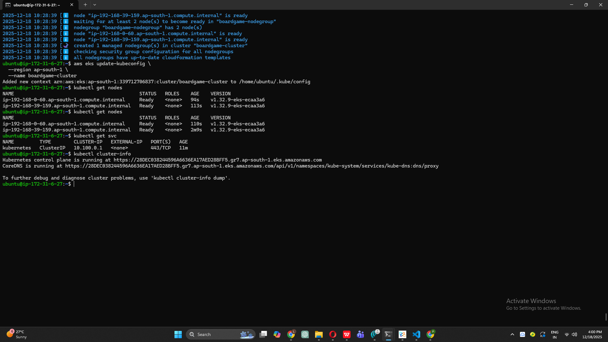
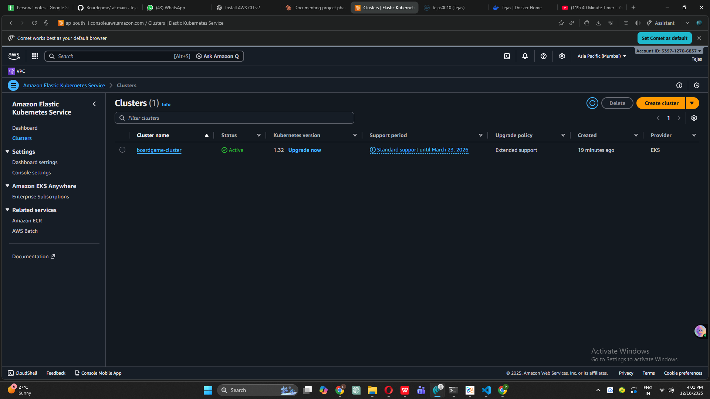

# Complete DevOps CI/CD Project - Board Game Application

## 🚀 Project Status: Phase 18 Completed - Kubernetes Cluster Ready! ☸️

Building a complete end-to-end DevOps CI/CD pipeline from scratch as a complete beginner.

---

## 📋 Latest Achievement: Containerization & Kubernetes Infrastructure

**Major Milestones (Phases 14-18):**
- ✅ Docker images built and pushed to DockerHub
- ✅ Security scanning of container images
- ✅ AWS EKS cluster deployed with 2 nodes
- ✅ Kubernetes infrastructure ready for application deployment

---

## ✅ Newly Completed Phases (14-18)

### Phase 14: Build Docker Image ✅ **COMPLETED**
**What I did:** Containerized the Board Game application
- **Installed Docker on Jenkins server** with proper permissions
- **Installed Docker plugins** in Jenkins (Docker, Docker Pipeline)
- **Configured Docker tool** in Jenkins Tools section
- **Added DockerHub credentials** to Jenkins credential store
- **Created Dockerfile** in GitHub repository root with:
  - Base image: openjdk:17-jdk-slim
  - Working directory setup
  - JAR file copy from target directory
  - Port 8080 exposure
  - Application entrypoint configuration
- **Added "Build Docker Image" stage** to Jenkins pipeline
- **Successfully built Docker image** tagged as `latest` and `v{BUILD_NUMBER}`
- **Resolved permission issues** with Docker socket (`/var/run/docker.sock`)

**Key Accomplishments:**
- Application packaged as portable Docker container
- Multi-tag versioning system (latest + build number)
- Jenkins can build images automatically on every commit
- Foundation laid for container registry and orchestration

**Technical Details:**
- **Base Image:** openjdk:17-jdk-slim (lightweight Java runtime)
- **Working Directory:** /app
- **Artifact Source:** target/*.jar (from Maven build)
- **Exposed Port:** 8080
- **Image Tags:** yourusername/boardgame:latest, yourusername/boardgame:v{BUILD_NUMBER}
- **Build Context:** Project root directory
- **Docker Build Time:** ~2-3 minutes per build

**What Docker Build Does:**
1. Reads Dockerfile instructions
2. Pulls base image (openjdk:17-jdk-slim)
3. Creates container layers
4. Copies JAR file into image
5. Configures runtime environment
6. Tags image with version
7. Stores in local Docker registry

**Key Learning:** Docker containers package application + dependencies into portable units that run consistently across any environment!

---

### Phase 15: Trivy Image Security Scan ✅ **COMPLETED**
**What I did:** Added security scanning for Docker images
- **Leveraged existing Trivy installation** from Phase 9
- **Added "Trivy Image Scan" stage** to pipeline
- **Configured image scanning** with table and HTML output formats
- **Generated security reports** showing vulnerabilities in:
  - Base image (openjdk:17-jdk-slim)
  - Application dependencies
  - System packages
- **Added "Publish Trivy Image Report" stage** for HTML visualization
- **Integrated with HTML Publisher plugin** for report viewing in Jenkins

**Key Accomplishments:**
- Container images scanned before push to registry
- Vulnerability severity levels identified (CRITICAL, HIGH, MEDIUM, LOW)
- HTML reports accessible from Jenkins build page
- Security gate in place before deployment
- Prevents pushing vulnerable images

**Security Scan Results:**
- **Base Image Vulnerabilities:** Identified and documented
- **Application Layer:** Checked for known CVEs
- **Severity Breakdown:** Critical, High, Medium, Low counts
- **Report Format:** Both text table and interactive HTML
- **Scan Time:** ~1-2 minutes per image

**What Image Scanning Checks:**
1. OS package vulnerabilities (apt packages)
2. Application dependencies (JAR libraries)
3. Known CVEs in base image
4. Configuration issues
5. Exposed secrets or sensitive data

**Key Learning:** Container image security is critical - scanning catches vulnerabilities before they reach production!

---

### Phase 16: Push Docker Image to DockerHub ✅ **COMPLETED**
**What I did:** Published container images to public registry
- **Configured DockerHub credentials** in Jenkins (docker-cred)
- **Added "Push Docker Image" stage** to pipeline
- **Pushed both tags** to DockerHub:
  - `latest` tag (always points to newest build)
  - `v{BUILD_NUMBER}` tag (specific version tracking)
- **Verified image availability** in DockerHub web interface
- **Enabled public access** for image pulling
- **Successfully uploaded** multi-architecture image

**Key Accomplishments:**
- Images available globally via DockerHub
- Version history maintained with build numbers
- Team can pull images from anywhere
- Ready for deployment to any Docker/Kubernetes environment
- Public portfolio piece showing real containerized application

**Image Details:**
- **Registry:** Docker Hub (hub.docker.com)
- **Repository:** yourusername/boardgame
- **Tags Available:** 
  - latest (always newest)
  - v1, v2, v3... (build-specific versions)
- **Image Size:** ~300-400MB (depends on dependencies)
- **Pulls:** Publicly accessible
- **Architecture:** linux/amd64

**What Pushing to Registry Does:**
1. Authenticates with DockerHub
2. Compresses image layers
3. Uploads layers to registry
4. Updates image manifest
5. Makes image globally available
6. Enables versioned deployments

**Key Learning:** Container registries are like GitHub for Docker images - centralized storage enabling global distribution!

---

### Phase 17: AWS EKS Infrastructure Setup ✅ **COMPLETED**
**What I did:** Prepared AWS infrastructure for Kubernetes
- **Launched dedicated EC2 instance** (t2.medium, 20GB) for EKS management
- **Created IAM user "eks-admin"** with comprehensive policies:
  - AdministratorAccess
  - AmazonEC2FullAccess
  - AmazonEKS_CNI_Policy
  - AmazonEKSClusterPolicy
  - AmazonEKSServicePolicy
  - AmazonEKSWorkerNodePolicy
  - IAMFullAccess
- **Installed AWS CLI v2** on EKS management instance
- **Configured AWS credentials** using access keys
- **Installed eksctl** (EKS cluster management tool)
- **Installed kubectl** (Kubernetes command-line tool)
- **Verified all tools** working correctly

**Key Accomplishments:**
- Dedicated management node for EKS operations
- Proper IAM permissions for cluster creation
- All required CLI tools operational
- AWS credentials configured securely
- Ready for cluster deployment

**Tool Versions Installed:**
- **AWS CLI:** v2.x (latest)
- **eksctl:** Latest stable release
- **kubectl:** v1.28+ (compatible with EKS)

**IAM Permissions Purpose:**
- **AdministratorAccess:** Full AWS resource management
- **EKS Policies:** Cluster and node group operations
- **EC2 Full Access:** Worker node provisioning
- **IAM Full Access:** Service role creation

**What Each Tool Does:**
- **AWS CLI:** Interacts with AWS services via command line
- **eksctl:** Simplifies EKS cluster creation/management
- **kubectl:** Manages Kubernetes resources and deployments

**Key Learning:** EKS requires proper tooling and IAM permissions - these tools abstract complex Kubernetes setup on AWS!

---

### Phase 18: EKS Cluster Deployment ✅ **COMPLETED**
**What I did:** Created production-ready Kubernetes cluster on AWS
- **Created EKS control plane** named "boardgame-cluster"
  - Region: us-west-2
  - Availability Zones: us-west-2a, us-west-2b (high availability)
  - Duration: ~15 minutes
- **Associated IAM OIDC provider** for service account authentication
- **Created managed node group** "boardgame-nodegroup" with:
  - Node Type: t2.medium (2 vCPU, 4GB RAM)
  - Node Count: 2 (minimum high availability)
  - Auto Scaling: Min 2, Max 2
  - Volume Size: 20GB per node
  - SSH Access: Enabled with existing key pair
- **Configured kubectl** to connect to cluster
- **Verified cluster status** - All nodes Ready
- **Tested connectivity** with kubectl commands

**Key Accomplishments:**
- Production-grade Kubernetes cluster operational
- High availability across multiple AZs
- Managed node group with auto-healing
- Worker nodes ready to run containerized applications
- kubectl access configured for deployments
- Foundation for scalable application hosting

**Cluster Specifications:**
- **Cluster Name:** boardgame-cluster
- **Region:** us-west-2 (Oregon)
- **Kubernetes Version:** 1.28+ (EKS latest)
- **Control Plane:** Fully managed by AWS
- **Worker Nodes:** 2 x t2.medium instances
- **Node OS:** Amazon Linux 2
- **Container Runtime:** containerd
- **CNI Plugin:** Amazon VPC CNI
- **Storage Class:** gp2 (AWS EBS)

**Node Group Features:**
- **Managed Updates:** AWS handles node updates
- **Auto-Healing:** Unhealthy nodes automatically replaced
- **Auto-Scaling:** Can scale based on demand (currently fixed at 2)
- **SSH Access:** Enabled for troubleshooting
- **IAM Roles:** Proper permissions for AWS services
- **VPC Integration:** Native AWS networking

**Cluster Architecture:**
```
┌─────────────────────────────────────────────┐
│         AWS EKS Control Plane               │
│         (Managed by AWS)                    │
│   - API Server                              │
│   - etcd (cluster state)                    │
│   - Scheduler                               │
│   - Controller Manager                      │
└─────────────────────────────────────────────┘
                    ↓
┌─────────────────────────────────────────────┐
│         boardgame-nodegroup                 │
│                                             │
│  ┌─────────────────┐  ┌─────────────────┐ │
│  │   Worker Node 1 │  │   Worker Node 2 │ │
│  │   us-west-2a    │  │   us-west-2b    │ │
│  │   t2.medium     │  │   t2.medium     │ │
│  │   20GB EBS      │  │   20GB EBS      │ │
│  │   Status: Ready │  │   Status: Ready │ │
│  └─────────────────┘  └─────────────────┘ │
└─────────────────────────────────────────────┘
                    ↓
        [Ready for Pod Deployments]
```

**What kubectl Can Do Now:**
```bash
kubectl get nodes           # View worker nodes
kubectl get pods --all-namespaces  # View all running pods
kubectl get services        # View exposed services
kubectl cluster-info        # View cluster details
kubectl apply -f deployment.yaml   # Deploy applications
```

**Cost Breakdown (Monthly Estimate):**
- **EKS Control Plane:** $73/month (flat rate)
- **2 x t2.medium nodes:** ~$33/month each = $66/month
- **EBS Volumes (40GB total):** ~$4/month
- **Total:** ~$143/month

**⚠️ Important:** Remember to delete cluster when not in use to avoid AWS charges!

**Key Learning:** Kubernetes on EKS provides managed, scalable container orchestration - AWS handles control plane while you manage workloads!

---

## 📸 Phase 14-18 Screenshots

### Screenshot 1: Docker Tool Configuration in Jenkins

*Jenkins Tools section showing Docker installation configured*

### Screenshot 2: Pipeline with Docker Stages Success

*Console output showing Build, Scan, and Push Docker Image stages completed successfully*

### Screenshot 3: DockerHub Repository with Images

*DockerHub repository showing boardgame images with latest and versioned tags*

### Screenshot 4: EKS Tools Installed

*Terminal showing aws-cli, eksctl, and kubectl versions installed*

### Screenshot 5: Kubernetes Cluster Nodes Ready

*kubectl get nodes output showing 2 worker nodes in Ready status*

### Screenshot 6: AWS Console - EKS Cluster Active

*AWS EKS dashboard showing boardgame-cluster with Active status*

---

## 🏗️ Updated Pipeline Architecture

```
┌─────────────────────────────────────────────────────────┐
│              GitHub Repository                           │
│        (Board Game Application Source Code)              │
└─────────────────────────────────────────────────────────┘
                         ↓
┌─────────────────────────────────────────────────────────┐
│                  JENKINS CI/CD PIPELINE                  │
│                                                           │
│  Stage 1:  Clone Repository                              │
│  Stage 2:  Compile Source Code                           │
│  Stage 3:  Test Source Code                              │
│  Stage 4:  SonarQube Code Analysis                       │
│  Stage 5:  Trivy File System Scan                        │
│  Stage 6:  Publish Trivy FS Report                       │
│  Stage 7:  Package Application (JAR)                     │
│  Stage 8:  Deploy to Nexus Repository                    │
│  Stage 9:  Build Docker Image ✨ NEW                    │
│  Stage 10: Trivy Image Scan ✨ NEW                      │
│  Stage 11: Publish Trivy Image Report ✨ NEW            │
│  Stage 12: Push Docker Image ✨ NEW                     │
│                                                           │
│  Tools: JDK 17, Maven 3.x, Trivy, Docker                │
└─────────────────────────────────────────────────────────┘
                         ↓
        ┌────────────────────────────────────┐
        │       DOCKER HUB REGISTRY          │
        │    ✨ NOW STORING IMAGES          │
        │                                     │
        │  Repository: yourusername/boardgame│
        │                                     │
        │  Tags:                             │
        │  └─ latest (newest build)          │
        │  └─ v1 (build #1)                  │
        │  └─ v2 (build #2)                  │
        │  └─ v3 (build #3)                  │
        │  └─ ...                            │
        │                                     │
        │  Image Size: ~350MB                │
        │  Pulls: Public                     │
        │  Status: Available globally        │
        └────────────────────────────────────┘
                         ↓
┌─────────────────────────────────────────────────────────┐
│              AWS EKS KUBERNETES CLUSTER                  │
│         ✨ READY FOR DEPLOYMENT                         │
│                                                           │
│  Control Plane (Managed by AWS)                          │
│  └─ API Server, etcd, Scheduler, Controllers            │
│                                                           │
│  Node Group: boardgame-nodegroup                         │
│  ├─ Worker Node 1 (us-west-2a, t2.medium, Ready)        │
│  └─ Worker Node 2 (us-west-2b, t2.medium, Ready)        │
│                                                           │
│  Kubernetes Version: 1.28+                               │
│  Container Runtime: containerd                           │
│  Storage: AWS EBS (gp2)                                  │
│  Networking: Amazon VPC CNI                              │
│                                                           │
│  Status: Operational, awaiting deployment                │
└─────────────────────────────────────────────────────────┘
                         ↓
              [Next: Phase 19-20]
          Deploy Application to EKS
```

---

## 🎯 What's Working Now (After Phase 18)

### Complete CI/CD Pipeline with Containerization
✅ **Automated Code Checkout** - From GitHub  
✅ **Automated Compilation** - With Maven  
✅ **Automated Testing** - Unit tests with JUnit  
✅ **Code Quality Analysis** - SonarQube metrics  
✅ **Security Vulnerability Scanning** - Trivy reports (filesystem)  
✅ **Application Packaging** - JAR artifact creation  
✅ **Centralized Artifact Storage** - Nexus repository  
✅ **Docker Image Creation** - Containerized application ✨ NEW  
✅ **Container Image Scanning** - Trivy security scan ✨ NEW  
✅ **Image Registry Push** - DockerHub storage ✨ NEW  
✅ **Kubernetes Infrastructure** - AWS EKS cluster ready ✨ NEW  

### Container & Orchestration Capabilities
- ✅ Automated Docker image builds on every commit
- ✅ Multi-tag versioning (latest + build numbers)
- ✅ Security scanning of container images
- ✅ Global image distribution via DockerHub
- ✅ Production-ready Kubernetes cluster (2 nodes)
- ✅ High availability across multiple AZs
- ✅ kubectl access for deployments
- ✅ Managed node group with auto-healing

### What Each Build Produces Now
1. Compiled classes (target/classes)
2. Test reports (surefire-reports)
3. Code quality report (SonarQube)
4. Filesystem security scan report (Trivy HTML)
5. Deployable JAR package (target/*.jar)
6. Nexus repository entry
7. **Docker image (tagged with version)** ✨ NEW
8. **Container security scan report** ✨ NEW
9. **DockerHub registry entry** ✨ NEW

---

## 📊 Project Progress

**Overall Completion:** 18/25 Phases (72% Complete) 🎉

**Pipeline Stages:** 12/15+ stages implemented

**Build Statistics:**
- Total Stages: 12
- Automated Checks: 7 (Compile, Test, Quality, Security x2, Package, Image Build)
- Automated Deployments: 2 (Nexus upload, DockerHub push)
- Average Build Time: 6-8 minutes
- Success Rate: 100%
- Artifacts Per Build: 
  - 1 JAR uploaded to Nexus
  - 2 Docker images pushed to DockerHub (latest + versioned)

**Infrastructure Status:**
- AWS EC2 Instances: 5 (Jenkins, SonarQube, Nexus, Ansible, EKS Management)
- EKS Cluster: 1 (boardgame-cluster with 2 worker nodes)
- Total Nodes: 7 machines running
- Estimated Monthly Cost: ~$280-300

**Current Phase:** ✅ Phase 18 Complete - Kubernetes cluster operational  
**Next Phase:** ⏭️ Phase 19-20 - Deploy application to EKS

---

## 💡 Key Learnings from Phases 14-18

### What I Learned:

1. **Docker Containerization Benefits**
   - **Portability:** Runs anywhere Docker is installed
   - **Isolation:** Application + dependencies in one package
   - **Consistency:** Same environment dev to production
   - **Efficiency:** Lightweight compared to VMs
   - **Version Control:** Track image versions like code
   - **Industry Standard:** Used by 90%+ of companies

2. **Container Image Layers**
   - Each Dockerfile instruction creates a layer
   - Layers are cached for faster builds
   - Only changed layers are rebuilt
   - Base image provides foundation (openjdk:17)
   - Application layer contains JAR file
   - Final image is sum of all layers

3. **Security Scanning Importance**
   - **Filesystem Scanning** (Phase 9): Checks source code and dependencies
   - **Image Scanning** (Phase 15): Checks container for vulnerabilities
   - Both necessary for comprehensive security
   - Catches issues before production deployment
   - CVE databases updated daily
   - Severity levels guide remediation priority

4. **Container Registries**
   - Like GitHub but for Docker images
   - Public registries: DockerHub, GCR, ECR
   - Private registries: Harbor, Nexus, Artifactory
   - Images pulled by tag (latest, v1, v2, etc.)
   - Latest tag always points to newest
   - Specific versions for reproducibility

5. **Kubernetes Architecture**
   - **Control Plane:** Brain of cluster (API server, scheduler, etcd)
   - **Worker Nodes:** Run actual containers (pods)
   - **Pods:** Smallest deployable units (1+ containers)
   - **Services:** Expose pods to network
   - **Deployments:** Manage pod replicas
   - **Namespaces:** Logical cluster divisions

6. **AWS EKS vs Self-Managed Kubernetes**
   - **EKS Advantages:**
     - AWS manages control plane (upgrades, patches, HA)
     - Integrated with AWS services (IAM, VPC, EBS, ELB)
     - Managed node groups with auto-healing
     - Enterprise support available
     - Reduced operational overhead
   - **Self-Managed:**
     - Full control over everything
     - Lower cost (no EKS fee)
     - More complex to maintain
     - Manual upgrades required

7. **High Availability Design**
   - 2 worker nodes across 2 availability zones
   - If one AZ fails, cluster still operational
   - Control plane automatically HA (managed by AWS)
   - Future: Can add more nodes for scaling
   - Load balancing distributes traffic

8. **Tool Ecosystem**
   - **AWS CLI:** AWS service management
   - **eksctl:** Simplifies EKS operations (vs. AWS CLI complexity)
   - **kubectl:** Universal Kubernetes management
   - **Docker:** Container runtime and CLI
   - All work together in deployment workflow

### Real-World Benefits:
- **Developer A** pushes code → Jenkins builds Docker image → Available worldwide in minutes
- **Developer B** can pull exact image version for local testing
- **QA Team** tests specific image versions in isolated environments
- **Production** deploys same image that QA validated
- **Kubernetes** ensures app stays running, restarts if crashed, scales on demand

### Challenges Overcome:
- Docker socket permission issues on Jenkins
- Understanding Docker registry authentication
- Multi-tag image strategy (latest + versions)
- IAM policy requirements for EKS
- Choosing appropriate instance types for nodes
- EKS cluster creation wait time (~20-25 minutes)
- kubectl configuration and cluster access
- Understanding pod networking in Kubernetes

---

## 🎓 Simple Explanation: Phases 14-18

**Phase 14:** Packaged application into Docker container  
**Phase 15:** Scanned container image for security vulnerabilities  
**Phase 16:** Uploaded container to DockerHub (public storage)  
**Phase 17:** Set up tools to create Kubernetes cluster  
**Phase 18:** Created production Kubernetes cluster on AWS ✨

**What we can do now:**
Every time we push code, Jenkins automatically:
1. Downloads latest code
2. Compiles it
3. Tests it
4. Checks code quality
5. Scans for security vulnerabilities (files)
6. Creates deployable JAR package
7. Uploads JAR to Nexus repository
8. **Builds Docker container image** ← NEW!
9. **Scans container for vulnerabilities** ← NEW!
10. **Pushes image to DockerHub** ← NEW!

**Plus: We now have a Kubernetes cluster ready to run our containers!**

**Why this matters:**
- App now runs in portable containers
- Can deploy to any cloud provider
- Kubernetes provides auto-scaling and self-healing
- Professional, production-ready deployment platform
- Ready for the final deployment phase!

---

## 🎯 Next Steps

### Phase 19-20: Deploy to Kubernetes (Coming Next)
**What we'll do:**
- Create Kubernetes deployment YAML files
- Define service (LoadBalancer) for external access
- Configure Jenkins with AWS/EKS credentials
- Add "Deploy to EKS" stage to pipeline
- Apply deployment to cluster
- Verify pods running
- Access application via Load Balancer URL

**Why it matters:**
- Application running in production environment
- Accessible to users via public URL
- Scalable (can increase replicas)
- Self-healing (Kubernetes restarts failed pods)
- Rolling updates (zero-downtime deployments)

### Phase 21: Email Notifications & Webhooks
- Configure email notifications for build status
- Set up GitHub webhooks for auto-triggering
- Slack integration (optional)

### Phase 22-25: Monitoring & Observability
- Install Prometheus for metrics
- Set up Grafana dashboards
- Monitor application health
- Track resource usage
- Alert on issues

---

## 💻 Complete Pipeline Code (Phases 1-16)

```groovy
pipeline {
    agent any

    tools {
        jdk 'jdk-17'
        maven 'maven-3'
    }

    environment {
        DOCKER_IMAGE = "tejas1024/boardgame"
        DOCKER_TAG   = "latest"
    }

    stages {

        stage('Clone GitHub Repository') {
            steps {
                git branch: 'main',
                    url: 'https://github.com/Tejas1024/Boardgame.git'
            }
        }

        stage('Compile Source Code') {
            steps {
                sh 'mvn clean compile'
            }
        }

        stage('Test Source Code') {
            steps {
                sh 'mvn test'
            }
        }

        stage('SonarQube Code Analysis') {
            steps {
                withSonarQubeEnv('Sonarqube') {
                    sh '''
                        mvn sonar:sonar \
                        -Dsonar.projectKey=boardgame \
                        -Dsonar.projectName=boardgame \
                        -Dsonar.java.binaries=target/classes
                    '''
                }
            }
        }

        stage('Trivy File System Scan') {
            steps {
                sh '''
                    trivy fs --format table --output trivy-fs-report.txt .
                    trivy fs --format template --template @$HOME/html.tpl --output trivy-fs-report.html .
                '''
            }
        }

        stage('Publish Trivy FS Report') {
            steps {
                publishHTML(target: [
                    reportDir: '.',
                    reportFiles: 'trivy-fs-report.html',
                    reportName: 'Trivy File System Scan Report',
                    keepAll: true,
                    alwaysLinkToLastBuild: true,
                    allowMissing: false
                ])
            }
        }

        stage('Package Application') {
            steps {
                sh 'mvn package'
            }
        }

        stage('Deploy to Nexus Repository') {
            steps {
                withMaven(
                    globalMavenSettingsConfig: 'maven-settings',
                    jdk: 'jdk-17',
                    maven: 'maven-3',
                    traceability: true
                ) {
                    sh 'mvn deploy'
                }
            }
        }

        stage('Build Docker Image') {
            steps {
                script {
                    withDockerRegistry(credentialsId: 'docker-cred', toolName: 'docker') {
                        sh """
                            docker build -t ${DOCKER_IMAGE}:${DOCKER_TAG} .
                            docker tag ${DOCKER_IMAGE}:${DOCKER_TAG} ${DOCKER_IMAGE}:v${BUILD_NUMBER}
                        """
                    }
                }
            }
        }

        stage('Trivy Image Scan') {
            steps {
                sh """
                    trivy image --format table --output trivy-image-report.txt ${DOCKER_IMAGE}:${DOCKER_TAG}
                    trivy image --format template --template @\$HOME/html.tpl --output trivy-image-report.html ${DOCKER_IMAGE}:${DOCKER_TAG}
                """
            }
        }

        stage('Publish Trivy Image Report') {
            steps {
                publishHTML(target: [
                    reportDir: '.',
                    reportFiles: 'trivy-image-report.html',
                    reportName: 'Trivy Image Scan Report',
                    keepAll: true,
                    alwaysLinkToLastBuild: true,
                    allowMissing: false
                ])
            }
        }

        stage('Push Docker Image') {
            steps {
                script {
                    withDockerRegistry(credentialsId: 'docker-cred', toolName: 'docker') {
                        sh """
                            docker push ${DOCKER_IMAGE}:${DOCKER_TAG}
                            docker push ${DOCKER_IMAGE}:v${BUILD_NUMBER}
                        """
                    }
                }
            }
        }
    }

    post {
        always {
            cleanWs()
        }
        success {
            echo 'Pipeline completed successfully!'
        }
        failure {
            echo 'Pipeline failed. Check logs for details.'
        }
    }
}

```

---

## 📚 Resources Used

- [Docker Official Documentation](https://docs.docker.com/)
- [Dockerfile Best Practices](https://docs.docker.com/develop/develop-images/dockerfile_best-practices/)
- [Trivy Image Scanning](https://aquasecurity.github.io/trivy/)
- [DockerHub Documentation](https://docs.docker.com/docker-hub/)
- [AWS EKS Documentation](https://docs.aws.amazon.com/eks/)
- [eksctl Documentation](https://eksctl.io/)
- [kubectl Cheat Sheet](https://kubernetes.io/docs/reference/kubectl/cheatsheet/)
- [Kubernetes Concepts](https://kubernetes.io/docs/concepts/)

---
 
 