# 🚀 Complete DevOps CI/CD Pipeline - Board Game Application

[](https://github.com/Tejas1024/Boardgame)
[](https://github.com/Tejas1024/Boardgame)
[](https://github.com/Tejas1024/Boardgame)
[](https://hub.docker.com/r/tejas1024/boardgame)

> **A complete end-to-end DevOps CI/CD pipeline built from scratch, demonstrating production-grade practices with AWS, Jenkins, Docker, Kubernetes, and comprehensive monitoring.**

---

## 📋 Table of Contents

- [Overview](#-overview)
- [Architecture](#-architecture)
- [Technology Stack](#-technology-stack)
- [Pipeline Stages](#-pipeline-stages)
- [Visual Journey](#-visual-journey-screenshots)
- [Key Features](#-key-features)
- [Challenges & Solutions](#-challenges--solutions)
- [Getting Started](#-getting-started)
- [Monitoring](#-monitoring--observability)
- [Lessons Learned](#-lessons-learned)
- [Future Enhancements](#-future-enhancements)

---

## 🎯 Overview

This project showcases a **production-ready CI/CD pipeline** for a Java Spring Boot Board Game application, implementing industry-standard DevOps practices from infrastructure provisioning to production deployment and monitoring.

### 📊 Project Statistics

| Metric | Value |
|--------|-------|
| **Total Phases** | 25 |
| **Pipeline Stages** | 13 |
| **Technologies Used** | 15+ |
| **AWS Resources** | 7 EC2 instances |
| **Build Time** | 8-12 minutes |
| **Deployment Target** | Kubernetes (EKS) |
| **Monitoring Stack** | Prometheus + Grafana |

### 🎓 What This Demonstrates

✅ **Infrastructure as Code** - Automated AWS provisioning with Terraform  
✅ **Configuration Management** - Ansible for multi-server automation  
✅ **Continuous Integration** - Automated build, test, and quality checks  
✅ **Security First** - Dual vulnerability scanning (filesystem + container)  
✅ **Containerization** - Docker images with multi-tag versioning  
✅ **Cloud Native Deployment** - Kubernetes on AWS EKS  
✅ **Monitoring & Observability** - Real-time metrics with Prometheus/Grafana  
✅ **Automation** - GitHub webhooks + email notifications  

---

## 🏗️ Architecture

```
┌─────────────────────────────────────────────────────────────────┐
│                      DEVELOPER WORKFLOW                          │
│                                                                   │
│  Developer → Git Push → GitHub Webhook → Jenkins Pipeline        │
└─────────────────────────────────────────────────────────────────┘
                              ↓
┌─────────────────────────────────────────────────────────────────┐
│                   CI/CD PIPELINE (13 Stages)                     │
│                                                                   │
│  ┌──────────────────────────────────────────────────────────┐   │
│  │ 1. Clone Repository          → GitHub                    │   │
│  │ 2. Compile Code             → Maven                      │   │
│  │ 3. Run Tests                → JUnit                      │   │
│  │ 4. Code Quality Analysis    → SonarQube                  │   │
│  │ 5. Security Scan (FS)       → Trivy                      │   │
│  │ 6. Publish Security Report  → HTML                       │   │
│  │ 7. Package Application      → Maven (JAR)                │   │
│  │ 8. Deploy to Nexus          → Artifact Repository        │   │
│  │ 9. Build Docker Image       → Docker                     │   │
│  │ 10. Security Scan (Image)   → Trivy                      │   │
│  │ 11. Publish Image Report    → HTML                       │   │
│  │ 12. Push to Registry        → DockerHub                  │   │
│  │ 13. Deploy to Kubernetes    → AWS EKS                    │   │
│  └──────────────────────────────────────────────────────────┘   │
└─────────────────────────────────────────────────────────────────┘
                              ↓
┌─────────────────────────────────────────────────────────────────┐
│                    PRODUCTION ENVIRONMENT                        │
│                                                                   │
│  ┌─────────────────────────────────────────────────────────┐    │
│  │  AWS EKS Kubernetes Cluster                             │    │
│  │                                                           │    │
│  │  ┌──────────┐  ┌──────────┐                            │    │
│  │  │  Pod 1   │  │  Pod 2   │  ← Application Replicas    │    │
│  │  │  :8080   │  │  :8080   │                            │    │
│  │  └──────────┘  └──────────┘                            │    │
│  │        ↓              ↓                                  │    │
│  │  ┌───────────────────────┐                             │    │
│  │  │  LoadBalancer Service │  ← External Access          │    │
│  │  │  Port 80 → 8080       │                             │    │
│  │  └───────────────────────┘                             │    │
│  └─────────────────────────────────────────────────────────┘    │
└─────────────────────────────────────────────────────────────────┘
                              ↓
┌─────────────────────────────────────────────────────────────────┐
│              MONITORING & OBSERVABILITY STACK                    │
│                                                                   │
│  Prometheus (Metrics) → Grafana (Visualization)                  │
│  Blackbox Exporter (Health Checks) → Email Alerts               │
└─────────────────────────────────────────────────────────────────┘
```

---

## 💻 Technology Stack

### Infrastructure & Cloud
- **AWS EC2** - Cloud compute instances
- **Terraform** - Infrastructure as Code
- **Ansible** - Configuration management automation

### CI/CD Pipeline
- **Jenkins** - Automation server (13-stage pipeline)
- **GitHub** - Source code repository
- **GitHub Webhooks** - Automated build triggers

### Build & Quality Tools
- **Maven** - Java build tool
- **JDK 17** - Java Development Kit
- **JUnit** - Unit testing framework
- **SonarQube** - Code quality analysis

### Security
- **Trivy** - Vulnerability scanner (filesystem + images)
- **AWS IAM** - Identity and access management

### Containerization
- **Docker** - Container runtime
- **DockerHub** - Container registry
- **Dockerfile** - Multi-stage builds

### Orchestration
- **Kubernetes** - Container orchestration
- **AWS EKS** - Managed Kubernetes service
- **kubectl** - Kubernetes CLI
- **eksctl** - EKS cluster management

### Artifact Management
- **Nexus Repository** - Maven artifact storage

### Monitoring
- **Prometheus** - Metrics collection
- **Grafana** - Visualization dashboards
- **Blackbox Exporter** - HTTP endpoint monitoring

### Notifications
- **Extended Email Plugin** - Jenkins email notifications
- **SMTP** - Email delivery

---

## 🔄 Pipeline Stages

| Stage | Tool | Purpose | Duration |
|-------|------|---------|----------|
| **1. Clone Repository** | Git | Download latest source code | ~10s |
| **2. Compile** | Maven | Compile Java source files | ~30s |
| **3. Test** | Maven + JUnit | Execute unit tests | ~45s |
| **4. Code Quality** | SonarQube | Analyze code quality & bugs | ~1m |
| **5. FS Security Scan** | Trivy | Scan files for vulnerabilities | ~1m |
| **6. Publish FS Report** | HTML Publisher | Display security report | ~5s |
| **7. Package** | Maven | Create JAR artifact | ~30s |
| **8. Deploy to Nexus** | Maven | Upload artifact to repository | ~20s |
| **9. Build Docker Image** | Docker | Containerize application | ~2m |
| **10. Image Security Scan** | Trivy | Scan container for vulnerabilities | ~1m |
| **11. Publish Image Report** | HTML Publisher | Display image security report | ~5s |
| **12. Push to DockerHub** | Docker | Upload image to registry | ~1m |
| **13. Deploy to EKS** | kubectl | Deploy to Kubernetes cluster | ~30s |

**Total Pipeline Duration:** ~8-12 minutes

---

## 📸 Visual Journey (Screenshots)

### Phase 1-2: Infrastructure Setup

**Terraform Infrastructure Provisioning**

*Automated EC2 instance creation with Terraform*

**Ansible Docker Installation**

*Automated Docker installation across multiple servers*

---

### Phase 3-6: Tool Configuration

**SonarQube Dashboard**

*Code quality analysis server ready*

**Nexus Repository Manager**

*Artifact repository for Maven builds*

**Jenkins Installation**

*CI/CD automation server operational*

**Jenkins Tools Configuration**
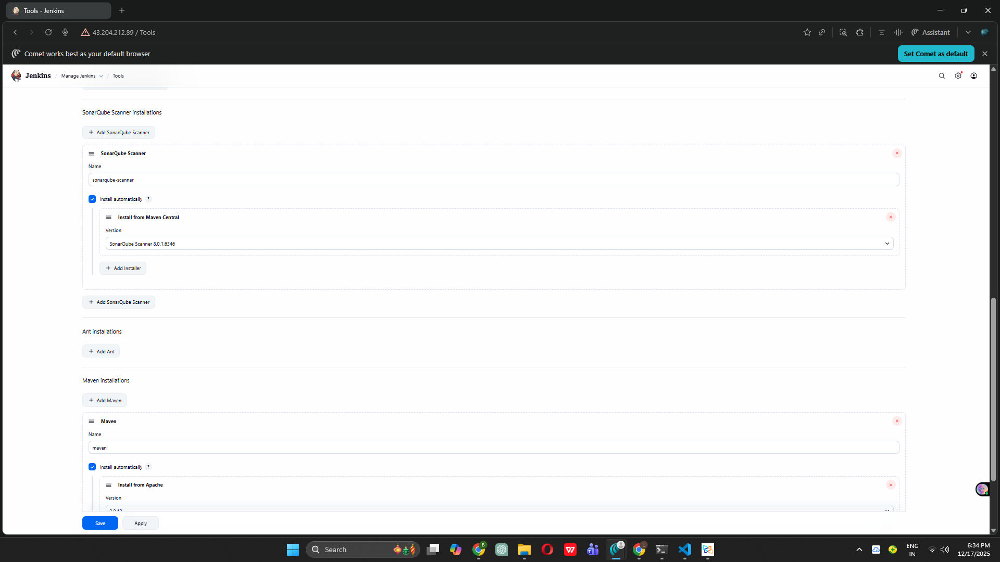
*JDK 17, Maven, and SonarQube Scanner configured*

---

### Phase 7-11: Pipeline Development

**First 3-Stage Pipeline**
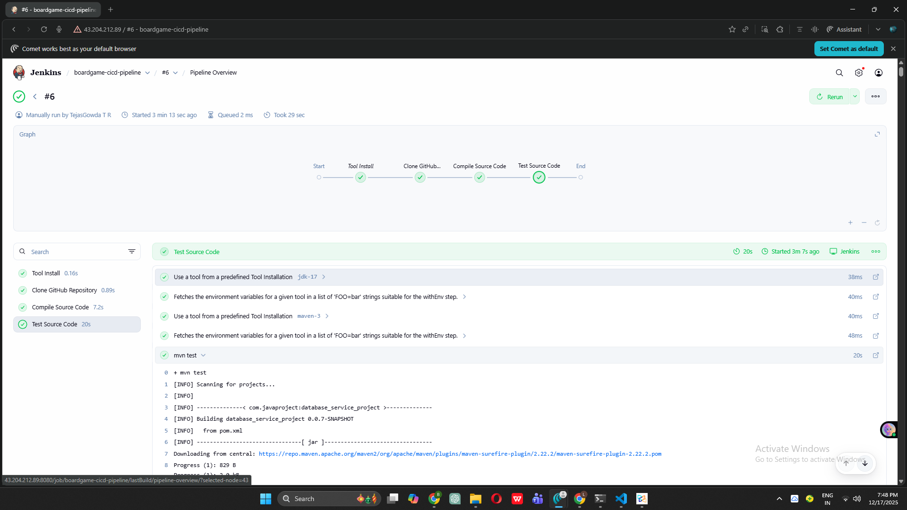
*Clone → Compile → Test stages working*

**SonarQube Integration**
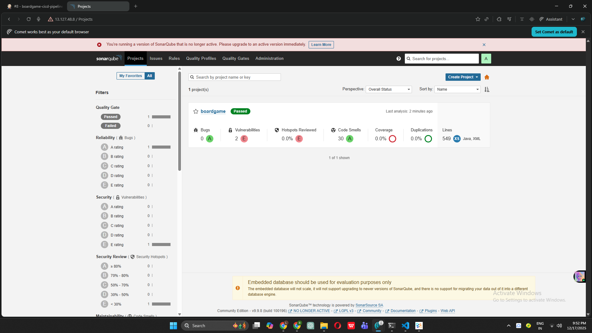
*Code quality metrics in SonarQube dashboard*

**Trivy Security Scanning**

*Filesystem vulnerability scan report*

**Maven Packaging**
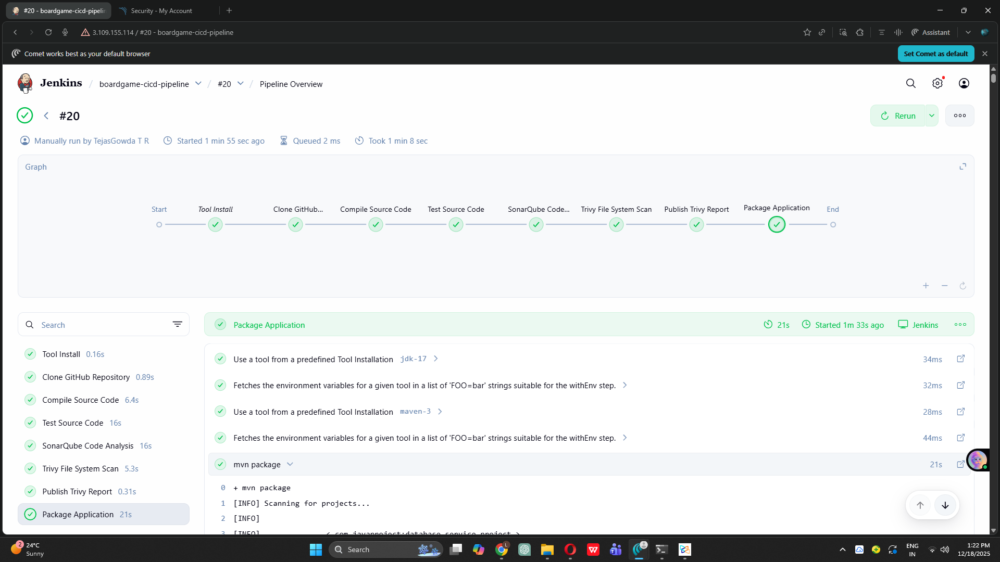
*JAR artifact successfully created*

**Nexus Deployment**
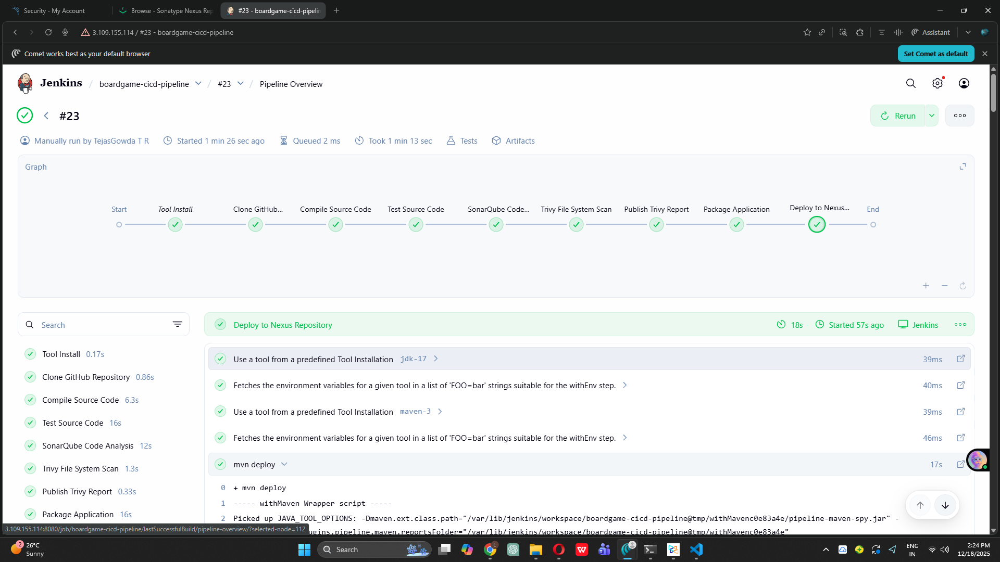
*Artifacts uploaded to Nexus repository*

---

### Phase 14-16: Containerization

**Docker Tool Configuration**
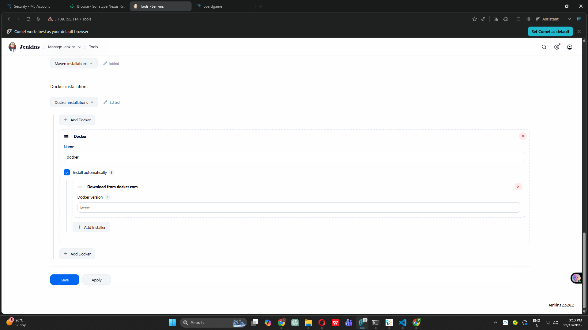
*Docker configured in Jenkins*

**Docker Pipeline Stages**
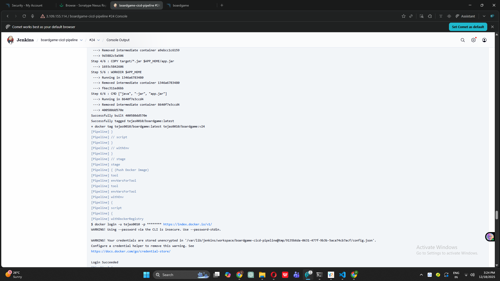
*Build → Scan → Push Docker images*

**DockerHub Repository**

*Multiple versioned images in DockerHub*

---

### Phase 17-20: Kubernetes Deployment

**AWS CLI Configuration**

*AWS tools configured for EKS management*

**Kubernetes Deployment YAML**
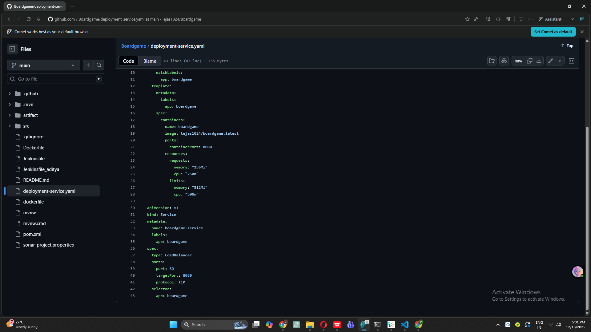
*Kubernetes deployment configuration*

**Pipeline with EKS Stage**
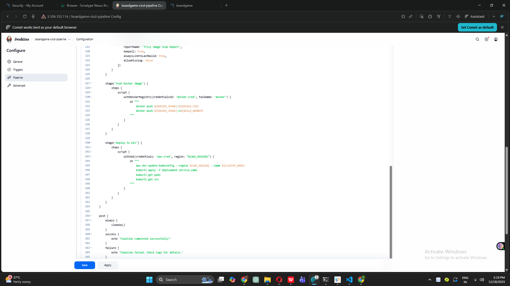
*Complete pipeline with Kubernetes deployment*

**All Stages Successful**
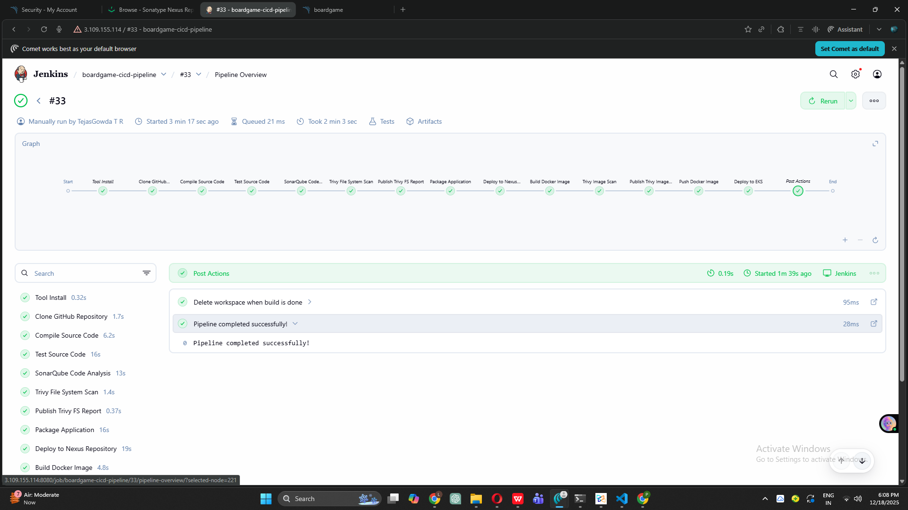
*13 stages completed successfully*

**Application Running on EKS**
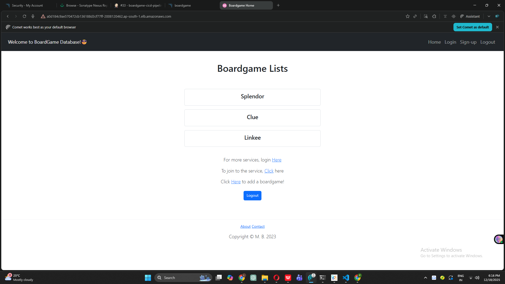
*Board Game application accessible via LoadBalancer*

---

### Phase 21-25: Automation & Monitoring

**GitHub Webhook Configuration**
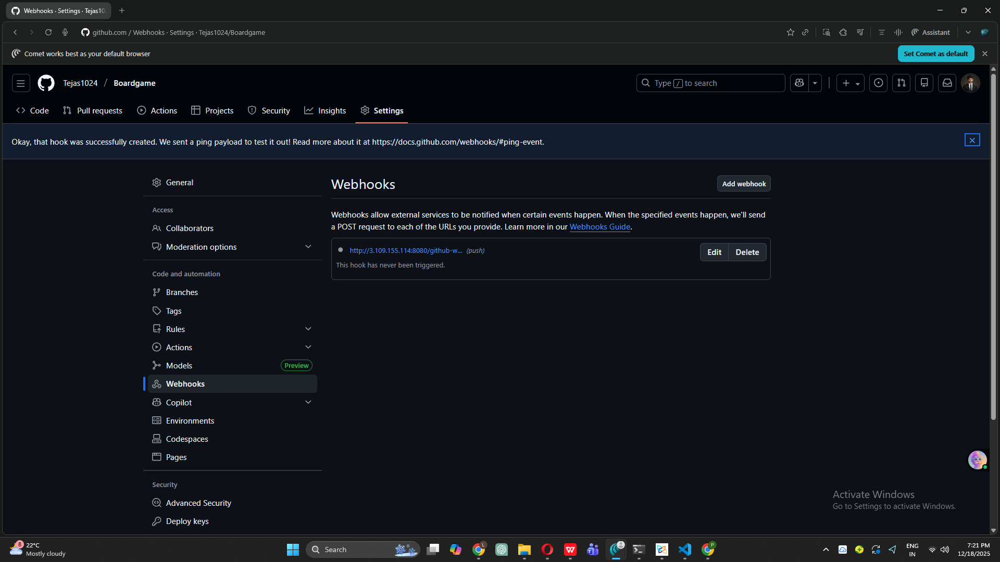
*Automated build triggers on code push*

**Prometheus Metrics**
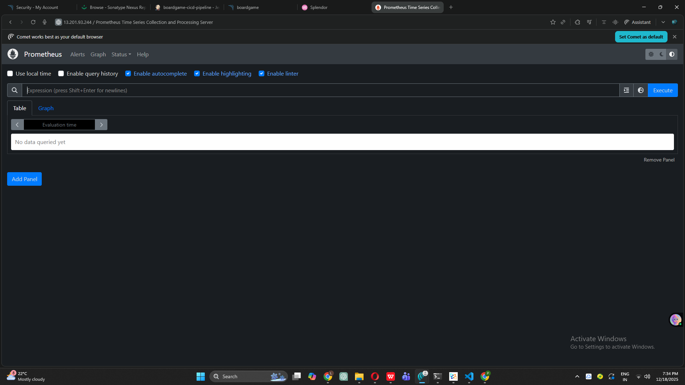
*Time-series metrics collection*

**Grafana Login**
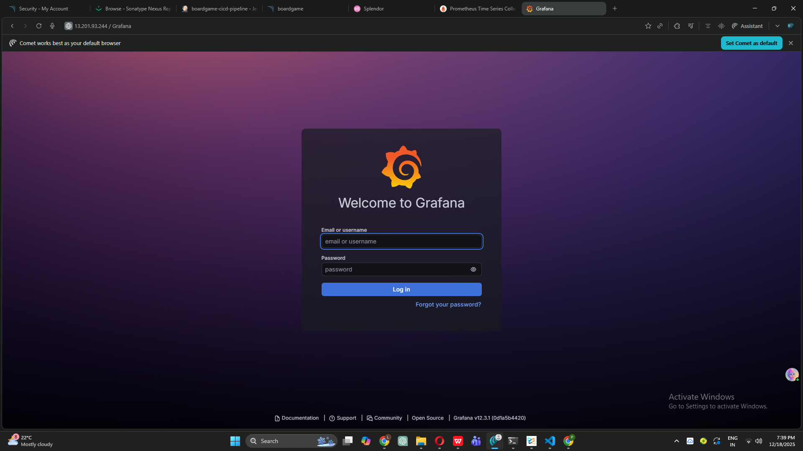
*Monitoring dashboard interface*

**Prometheus Targets**
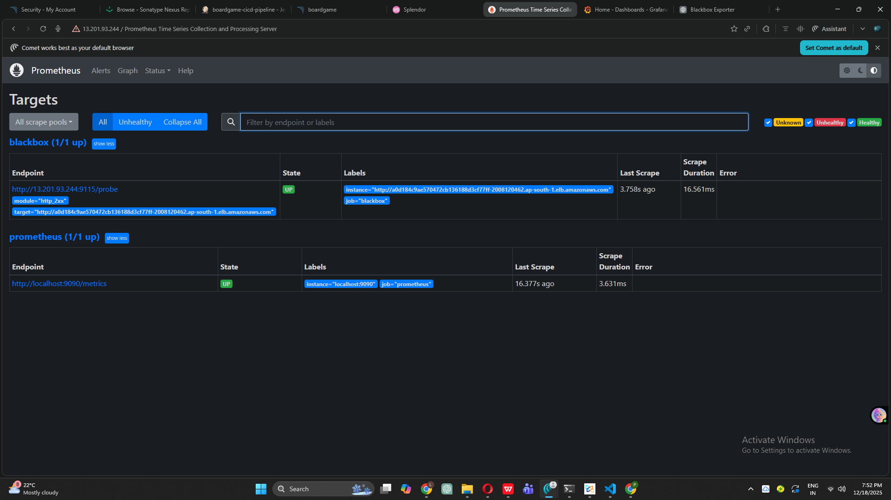
*Application endpoints being monitored*

**Grafana Dashboard**
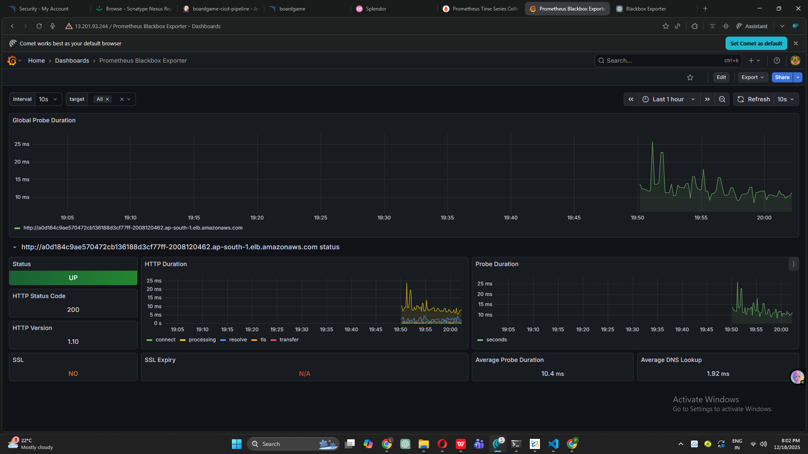
*Real-time application metrics visualization*

**Complete Production Pipeline**
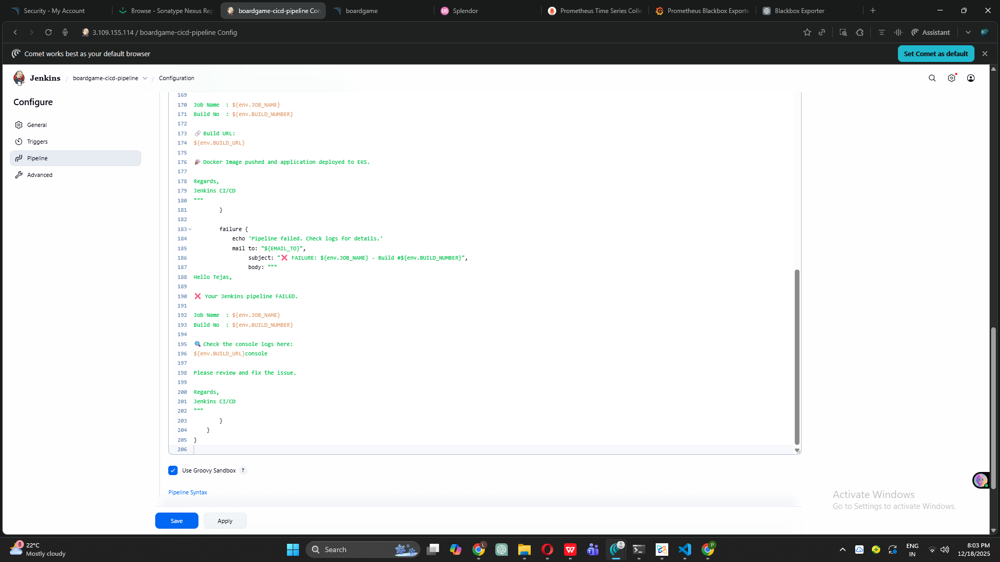
*All 13 stages of production-ready pipeline*

---

## ✨ Key Features

### 🔒 Security
- **Dual Security Scanning**: Filesystem + Container image vulnerability detection
- **Trivy Integration**: CVE detection with severity levels (CRITICAL, HIGH, MEDIUM, LOW)
- **HTML Security Reports**: Easy-to-read vulnerability reports in Jenkins
- **IAM Policies**: Least-privilege access for AWS resources
- **Secure Credentials**: Jenkins credential store for sensitive data

### 🚀 Automation
- **GitHub Webhooks**: Auto-trigger builds on code push
- **Email Notifications**: Success/failure alerts with build details
- **Automated Testing**: Unit tests run on every build
- **Quality Gates**: SonarQube analysis blocks poor code
- **One-Click Deployment**: Full pipeline from commit to production

### 📦 Artifact Management
- **Version Control**: SNAPSHOT and RELEASE versioning in Nexus
- **Docker Multi-Tagging**: `latest` + build number tags
- **Artifact History**: Access any previous build's artifacts
- **Centralized Storage**: Nexus for JARs, DockerHub for images

### ☸️ Cloud Native
- **Kubernetes Deployment**: 2-replica pods with auto-healing
- **LoadBalancer Service**: External access via AWS ELB
- **High Availability**: Multi-AZ deployment (us-west-2a, us-west-2b)
- **Scalable Infrastructure**: Can scale to meet demand
- **Rolling Updates**: Zero-downtime deployments

### 📊 Monitoring
- **Prometheus**: Metrics collection every 15 seconds
- **Grafana Dashboards**: Visual representation of system health
- **Blackbox Exporter**: HTTP endpoint health checks
- **Real-Time Alerts**: Immediate notification of issues
- **Historical Data**: Trend analysis and capacity planning

---

## 🛠️ Challenges & Solutions

### Infrastructure Challenges

#### ❌ **Challenge 1: WSL Filesystem Issues**
**Problem:** AWS CLI installation failed in `/mnt/c` (Windows mount)
```bash
# Failed approach
cd /mnt/c/Users/username
sudo ./aws/install
# Error: Python execution failed
```

**✅ Solution:** Always work in Linux filesystem
```bash
cd ~  # Linux home directory
curl "https://awscli.amazonaws.com/awscli-exe-linux-x86_64.zip" -o awscliv2.zip
unzip awscliv2.zip
sudo ./aws/install
```
**Lesson Learned:** WSL has two filesystems - use `~` (Linux) for DevOps tools, not `/mnt/c` (Windows).

---

#### ❌ **Challenge 2: Hardcoded AMI IDs Failing**
**Problem:** Terraform couldn't find AMI
```bash
terraform apply
# Error: collecting instance settings: couldn't find resource
```

**✅ Solution:** Use dynamic AMI lookup
```hcl
data "aws_ami" "ubuntu" {
  most_recent = true
  filter {
    name   = "name"
    values = ["ubuntu/images/hvm-ssd/ubuntu-jammy-22.04-amd64-server-*"]
  }
  owners = ["099720109477"] # Canonical
}

resource "aws_instance" "ins-01" {
  ami = data.aws_ami.ubuntu.id
}
```
**Lesson Learned:** Never hardcode AMI IDs - they're region-specific and get deprecated.

---

#### ❌ **Challenge 3: SSH Connection Timeout**
**Problem:** Couldn't connect to EC2 instance
```bash
ssh -i key.pem ubuntu@IP
# ssh: connect to host port 22: Connection timed out
```

**✅ Solution:** Add SSH rule to Security Group
- AWS Console → EC2 → Security Groups
- Add Inbound Rule: Type=SSH, Port=22, Source=0.0.0.0/0

**Lesson Learned:** No matter how correct your SSH key is, without port 22 open, connection will timeout.

---

### Configuration Management Challenges

#### ❌ **Challenge 4: Ansible Permission Denied**
**Problem:** Private key not accessible by Ansible
```bash
ansible servers -i inventory -m ping
# Permission denied (publickey)
```

**✅ Solution:** Securely copy SSH key using `scp`
```bash
# From local machine
scp -i key.pem key.pem ubuntu@ANSIBLE-IP:/home/ubuntu/
# On Ansible server
chmod 400 key.pem
```
**Lesson Learned:** Never manually copy-paste private keys. Use `scp` for secure file transfer.

---

### Jenkins & Build Challenges

#### ❌ **Challenge 5: Wrong Java Version Cached**
**Problem:** Jenkins tool "jdk-17" was actually Java 8
```bash
java -version
# openjdk version "1.8.0_472"
```

**✅ Solution:** Delete and recreate JDK configuration
1. Jenkins → Tools → Delete existing jdk-17
2. Add new JDK → Install from adoptium.net
3. Name: `jdk-17`, Version: `jdk-17.x (latest)`
4. Leave JAVA_HOME empty (Jenkins manages it)

**Lesson Learned:** Jenkins tool names don't guarantee versions. Always verify with test pipeline.

---

#### ❌ **Challenge 6: Maven Compiler Target Mismatch**
**Problem:** Maven compile error
```bash
mvn compile
# Fatal error compiling: invalid target release: 11
```

**✅ Solution:** Force JAVA_HOME in pipeline
```groovy
environment {
    JAVA_HOME = tool(name: 'jdk-17', type: 'hudson.model.JDK')
    PATH = "${JAVA_HOME}/bin:${env.PATH}"
}
```
**Lesson Learned:** Maven uses `JAVA_HOME`, not just Jenkins tool selection. Set it explicitly.

---

### SonarQube Challenges

#### ❌ **Challenge 7: SonarQube Container Crashes**
**Problem:** Container immediately stopped
```bash
docker logs sonarqube
# Elasticsearch bootstrap checks failed
```

**✅ Solution:** Increase kernel parameter
```bash
sudo sysctl -w vm.max_map_count=262144
echo "vm.max_map_count=262144" | sudo tee -a /etc/sysctl.conf
sudo sysctl -p
```
**Lesson Learned:** SonarQube requires this kernel setting on all Linux systems. It's mandatory.

---

#### ❌ **Challenge 8: Insufficient RAM**
**Problem:** SonarQube kept stopping on t2.micro
```bash
docker logs sonarqube
# Process[ElasticSearch] exited with value 143
```

**✅ Solution:** Upgraded to t2.medium (4GB RAM)

**Lesson Learned:** SonarQube minimum requirement is ~4GB RAM. Don't use t2.micro/small.

---

### Nexus Challenges

#### ❌ **Challenge 9: Resource Contention**
**Problem:** Both SonarQube and Nexus crashing on same server
```bash
docker ps -a
# sonarqube   Exited (255)
# nexus       Exited (255)
```

**✅ Solution:** Separated to different EC2 instances
- Server 1: SonarQube only
- Server 2: Nexus only

**Lesson Learned:** SonarQube and Nexus should run on separate hosts to avoid resource contention.

---

#### ❌ **Challenge 10: Duplicate pom.xml Configuration**
**Problem:** Maven deployment failing
```xml
<distributionManagement>
    <repository>
        <url>http://<http://13.127.109.29:8081/...</url>
```

**✅ Solution:** Cleaned up pom.xml
```xml
<distributionManagement>
    <repository>
        <id>maven-releases</id>
        <url>http://13.127.109.29:8081/repository/maven-releases/</url>
    </repository>
    <snapshotRepository>
        <id>maven-snapshots</id>
        <url>http://13.127.109.29:8081/repository/maven-snapshots/</url>
    </snapshotRepository>
</distributionManagement>
```
**Lesson Learned:** Maven `<id>` in settings.xml must match `<id>` in pom.xml exactly.

---

### Docker Challenges

#### ❌ **Challenge 11: DockerHub Username Confusion**
**Problem:** Access denied when pushing images
```
denied: requested access to the resource is denied
```

**✅ Solution:** Matched Docker login username with image tag
```groovy
environment {
    DOCKER_IMAGE = "tejas0010/boardgame"  // Must match login username
}
```
**Lesson Learned:** Docker username must match exactly across login, image naming, and credentials.

---

#### ❌ **Challenge 12: Docker Socket Permission**
**Problem:** Permission denied on Docker commands
```bash
docker ps
# permission denied while trying to connect to Docker daemon socket
```

**✅ Solution:** Add user to docker group
```bash
sudo usermod -aG docker ubuntu
newgrp docker
sudo chmod 666 /var/run/docker.sock  # For Jenkins
```
**Lesson Learned:** By default, only root can access Docker. Add users to `docker` group.

---

### Kubernetes Challenges

#### ❌ **Challenge 13: AWS CLI Not Found in Pipeline**
**Problem:** EKS deployment stage failed
```
aws: not found
```

**✅ Solution:** Install AWS CLI on Jenkins server
```bash
curl "https://awscli.amazonaws.com/awscli-exe-linux-x86_64.zip" -o awscliv2.zip
unzip awscliv2.zip
sudo ./aws/install
sudo systemctl restart jenkins
```
**Lesson Learned:** Jenkins can only run commands installed on the machine.

---

#### ❌ **Challenge 14: kubectl Command Not Found**
**Problem:** Kubernetes commands failing
```
kubectl: not found
```

**✅ Solution:** Install kubectl binary
```bash
curl -LO "https://dl.k8s.io/release/$(curl -Ls https://dl.k8s.io/release/stable.txt)/bin/linux/amd64/kubectl"
chmod +x kubectl
sudo mv kubectl /usr/local/bin/
sudo systemctl restart jenkins
```
**Lesson Learned:** CLI tools must be installed on Jenkins server and available in PATH.

---

### Email & Monitoring Challenges

#### ❌ **Challenge 15: Gmail SMTP Authentication Failures**
**Problem:** Multiple email errors
```
java.net.ConnectException: Connection refused
530-5.7.0 Authentication Required
```

**✅ Solution:** Use Gmail App Password
1. Enable 2-Step Verification in Google Account
2. Generate App Password (Security → App passwords)
3. Configure BOTH Extended Email AND E-mail Notification in Jenkins
4. Use app password (not regular password)

**Lesson Learned:** Gmail blocks normal passwords for security. App Password is mandatory.

---

#### ❌ **Challenge 16: Prometheus YAML Indentation Error**
**Problem:** Prometheus refusing to start
```
err="parsing YAML file prometheus.yml: yaml: line 29: did not find expected key"
```

**✅ Solution:** Fixed indentation (2 spaces per level)
```yaml
scrape_configs:
  - job_name: 'prometheus'
    static_configs:
      - targets: ['localhost:9090']
  
  - job_name: 'blackbox'
    metrics_path: /probe
    params:
      module: [http_2xx]
```
**Lesson Learned:** YAML requires exact indentation. Never use tabs.

---

### Cost Management Challenge

#### ❌ **Challenge 17: Unexpected AWS Costs**
**Problem:** Costs continued even after stopping instances

**✅ Solution:** Complete cleanup order
1. Delete EKS cluster (`eksctl delete cluster`)
2. Terminate EC2 instances
3. Delete NAT Gateway (expensive!)
4. Release Elastic IPs
5. Delete Load Balancers
6. Delete Target Groups
7. Clean Security Groups
8. Delete VPC (optional)

**Lesson Learned:** Stopped ≠ Terminated. NAT Gateway is one of the most expensive forgotten resources.

---

## 🚀 Getting Started

### Prerequisites

- AWS Account with billing enabled
- GitHub account
- Basic Linux command line knowledge
- Patience and willingness to learn!

### Quick Setup

1. **Clone the repository**
```bash
git clone https://github.com/Tejas1024/Boardgame.git
cd Boardgame
```

2. **Configure AWS CLI**
```bash
aws configure
# Enter Access Key ID and Secret Access Key
```

3. **Deploy Infrastructure**
```bash
cd terraform
terraform init
terraform plan
terraform apply
```

4. **Follow the documented phases** (1-25) in sequence

### Detailed Setup Guide

Comprehensive phase-by-phase guide available in:
- [Phase 01-05 Documentation](Phase01-05.md)
- [Phase 06 Documentation](Phase06.md)
- [Phase 07 Documentation](Phase07.md)
- [Phase 08 Documentation](Phase08.md)
- [Phase 09 Documentation](Phase09.md)
- [Phase 10 Documentation](Phase10.md)
- [Phase 11-13 Documentation](Phase11-13.md)
- [Phase 14-18 Documentation](Phase14-18.md)
- [Phase 19-25 Documentation](Phase19-25.md)
- [Issues & Solutions](Issues.md)

---

## 📊 Monitoring & Observability

### Prometheus Metrics
- **Endpoint:** `http://<prometheus-ip>:9090`
- **Scrape Interval:** 15 seconds
- **Retention:** 15 days
- **Targets:**
  - Prometheus itself (self-monitoring)
  - Application via Blackbox Exporter
  - Kubernetes API server

### Grafana Dashboards
- **Endpoint:** `http://<grafana-ip>:3000`
- **Default Credentials:** admin/admin (change on first login)
- **Dashboards:**
  - Blackbox Exporter Dashboard (ID: 7587)
  - Application HTTP response times
  - Target availability (UP/DOWN status)
  - Response code distribution

### Blackbox Exporter
- **Endpoint:** `http://<blackbox-ip>:9115`
- **Checks:**
  - HTTP 200 response verification
  - Response time tracking
  - SSL certificate expiration
  - DNS resolution time

### Email Alerts
- **Trigger Events:**
  - Build success/failure
  - Deployment completion
  - Security scan results
- **Recipients:** Configurable in Jenkins pipeline
- **Format:** HTML emails with build details and links

---

## 🎓 Lessons Learned

### Technical Insights

1. **Infrastructure as Code is Essential**
   - Manual setup is error-prone and not reproducible
   - Terraform state management is critical
   - Always use version control for infrastructure code

2. **Security Should Be Automated**
   - Manual security checks don't scale
   - Trivy catches vulnerabilities early
   - Dual scanning (FS + Image) provides comprehensive coverage

3. **Kubernetes Simplifies Operations**
   - Self-healing reduces downtime
   - Declarative configuration is easier to manage
   - EKS handles control plane complexity

4. **Monitoring is Not Optional**
   - Without metrics, you're flying blind
   - Prometheus + Grafana provide powerful insights
   - Proactive monitoring prevents reactive firefighting

5. **Documentation Saves Time**
   - Detailed docs help future troubleshooting
   - Screenshots prove what was accomplished
   - Error logs are valuable learning resources

### Best Practices Discovered

✅ **Always use dynamic AMI lookups** (never hardcode)  
✅ **Separate resource-intensive services** (SonarQube, Nexus on different servers)  
✅ **Test tools in isolation** before integrating into pipeline  
✅ **Use meaningful naming conventions** (tool names, credentials, etc.)  
✅ **Implement proper error handling** in pipeline stages  
✅ **Keep credentials out of code** (use Jenkins credential store)  
✅ **Monitor resource usage** to avoid cost surprises  
✅ **Document every challenge** for future reference  

### What I'd Do Differently

1. **Start with monitoring earlier** - Would have helped debug issues faster
2. **Use Helm charts** - Kubernetes deployments would be cleaner
3. **Implement GitOps** - ArgoCD for better deployment tracking
4. **Add automated testing** - Selenium for UI testing
5. **Use Terraform modules** - More reusable infrastructure code
6. **Implement cost alerts** - AWS Budgets from day one

---

## 🔮 Future Enhancements

### Short Term (1-2 weeks)
- [ ] Add Helm charts for Kubernetes deployments
- [ ] Implement blue-green deployment strategy
- [ ] Add Slack notifications
- [ ] Create custom Grafana dashboards
- [ ] Add automated rollback on failure

### Medium Term (1-2 months)
- [ ] Implement GitOps with ArgoCD
- [ ] Add HashiCorp Vault for secrets management
- [ ] Implement Istio service mesh
- [ ] Add automated UI testing with Selenium
- [ ] Multi-region deployment on AWS
- [ ] Implement disaster recovery plan

### Long Term (3-6 months)
- [ ] Chaos engineering with Chaos Monkey
- [ ] Machine learning for anomaly detection
- [ ] Cost optimization with Spot instances
- [ ] Implement FinOps practices
- [ ] Multi-cloud deployment (AWS + Azure)
- [ ] Advanced observability with distributed tracing

---

## 📚 Resources & References

### Official Documentation
- [AWS Documentation](https://docs.aws.amazon.com/)
- [Jenkins Documentation](https://www.jenkins.io/doc/)
- [Kubernetes Documentation](https://kubernetes.io/docs/)
- [Docker Documentation](https://docs.docker.com/)
- [Terraform Documentation](https://www.terraform.io/docs)
- [Ansible Documentation](https://docs.ansible.com/)

### Tools & Plugins
- [SonarQube Scanner](https://docs.sonarqube.org/latest/analysis/scan/sonarscanner-for-jenkins/)
- [Trivy Security Scanner](https://aquasecurity.github.io/trivy/)
- [Nexus Repository Manager](https://help.sonatype.com/repomanager3)
- [Prometheus](https://prometheus.io/docs/)
- [Grafana](https://grafana.com/docs/)

### Learning Resources
- [DevOps Roadmap](https://roadmap.sh/devops)
- [Kubernetes Tutorials](https://kubernetes.io/docs/tutorials/)
- [AWS Well-Architected Framework](https://aws.amazon.com/architecture/well-architected/)

