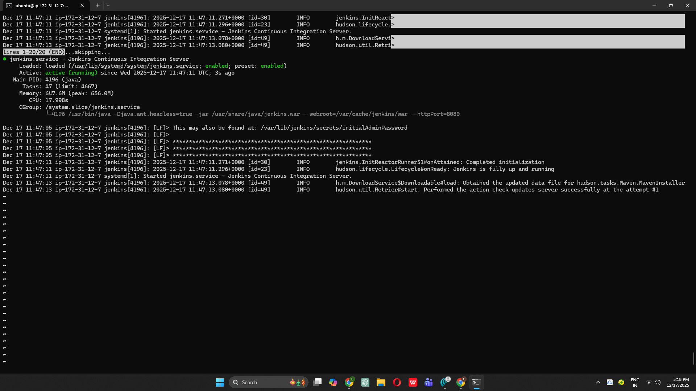
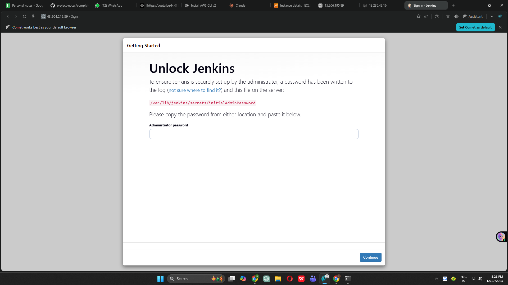
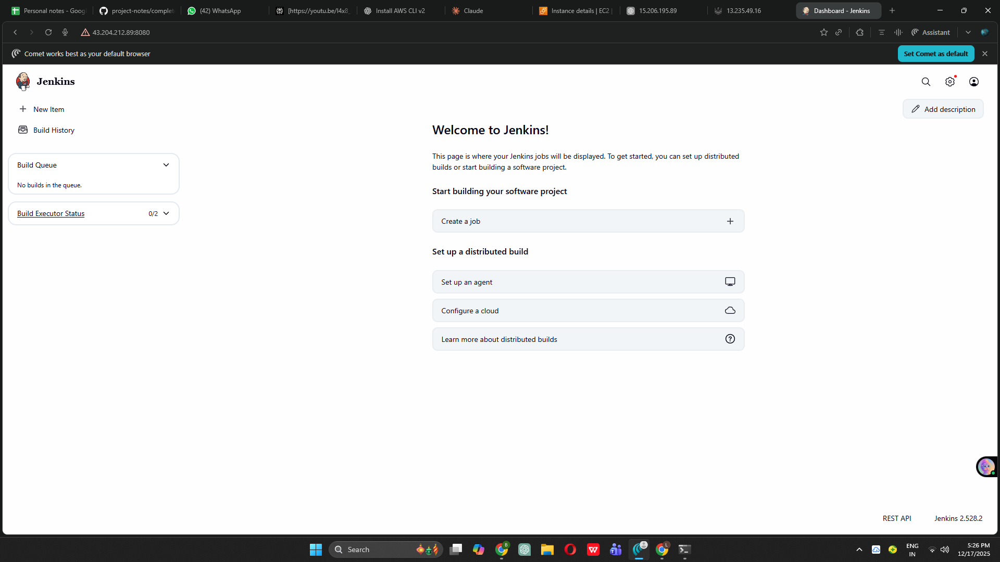

# Complete DevOps CI/CD Project - Board Game Application

## 🚀 Project Status: Phase 5 Completed

This repository documents my journey building a complete DevOps CI/CD pipeline from scratch as a beginner.

---

## 📋 Project Overview

Building an end-to-end DevOps pipeline for a Board Game Database application with the following tools:
- **Infrastructure**: AWS, Terraform
- **Configuration Management**: Ansible
- **CI/CD**: Jenkins
- **Code Quality**: SonarQube
- **Security**: Trivy
- **Artifact Repository**: Nexus
- **Containerization**: Docker
- **Orchestration**: Kubernetes (EKS)
- **Monitoring**: Prometheus & Grafana

---

## ✅ Completed Phases

### Phase 1: Infrastructure Setup with Terraform
**Objective**: Automated AWS infrastructure provisioning

**Key Accomplishments:**
- Created IAM user with administrative access
- Configured AWS CLI with access credentials
- Wrote Terraform configuration files (`provider.tf`, `main.tf`)
- Generated SSH key pair for secure EC2 access
- Launched 2 EC2 instances (t2.medium) with 20GB storage
- Implemented infrastructure as code principles

**Skills Learned:**
- Terraform syntax and resource management
- AWS EC2 instance configuration
- SSH key pair generation and management
- Infrastructure automation

---

### Phase 2: Configuration Management with Ansible
**Objective**: Automated Docker installation across multiple servers

**Key Accomplishments:**
- Launched dedicated Ansible control server (t2.medium, Ubuntu)
- Created inventory file with target server details
- Configured SSH authentication with private keys
- Wrote Ansible playbook for Docker installation
- Successfully deployed Docker on all target servers
- Verified connectivity using Ansible ping module

**Skills Learned:**
- Ansible inventory management
- Playbook creation and execution
- SSH key-based authentication
- Automated configuration management
- YAML syntax for playbooks

---

### Phase 3: SonarQube Setup
**Objective**: Code quality analysis infrastructure

**Key Accomplishments:**
- Connected to SonarQube server instance
- Configured Docker permissions (`/var/run/docker.sock`)
- Pulled official SonarQube Docker image
- Created and exposed SonarQube container on port 9000
- Successfully accessed SonarQube web interface
- Configured initial admin credentials
- Prepared dashboard for code quality analysis

**Skills Learned:**
- Docker container management
- Port mapping and exposure
- Container networking basics
- SonarQube initial configuration

---

### Phase 4: Nexus Repository Setup
**Objective**: Artifact repository management

**Key Accomplishments:**
- Connected to Nexus server instance
- Configured Docker socket permissions
- Pulled Nexus3 Docker image from Sonatype
- Created Nexus container with port 8081 exposed
- Retrieved initial admin password from container
- Set up Nexus dashboard with custom credentials
- Prepared repository for Maven artifact storage

**Skills Learned:**
- Docker exec commands for container access
- Artifact repository concepts
- Nexus repository management
- Container file system navigation

---

### Phase 5: Jenkins CI/CD Server Configuration ✨ **JUST COMPLETED**
**Objective**: Set up Jenkins for continuous integration and deployment

**Key Accomplishments:**
- Launched dedicated Jenkins EC2 instance (t2.medium, 15GB storage)
- Created automated installation script for Java 17 and Jenkins
- Configured Jenkins repository and GPG keys
- Successfully installed and started Jenkins service
- Enabled Jenkins to start on system boot
- Opened port 8080 in AWS security group
- Accessed Jenkins web interface
- Retrieved and used initial admin password
- Installed suggested Jenkins plugins
- Created first admin user
- Successfully logged into Jenkins dashboard

**Skills Learned:**
- Bash scripting for automation
- Linux service management (systemctl)
- File permissions and execution rights
- AWS security group configuration
- Jenkins initial setup and configuration
- Plugin management in Jenkins

---

## 📸 Screenshots - Phase 5

### Screenshot 1: Jenkins Service Running

*Jenkins service successfully installed and running on Ubuntu server*

### Screenshot 2: Jenkins Unlock Page

*Initial Jenkins setup page requesting administrator password*

### Screenshot 3: Jenkins Dashboard

*Jenkins successfully configured and ready for pipeline creation*

---

## 🛠️ Technical Architecture (So Far)

```
GitHub Repository (Source Code)
         ↓
    [JENKINS] ← Phase 5 Complete
         ↓
   Build & Test
         ↓
    [SONARQUBE] ← Phase 3 Complete (Code Quality)
         ↓
  Security Scan (Trivy)
         ↓
    [NEXUS] ← Phase 4 Complete (Artifact Storage)
         ↓
  Docker Image Creation
         ↓
  Push to DockerHub
         ↓
  Deploy to EKS
         ↓
  Monitoring (Prometheus & Grafana)
```

---

## 🎯 Next Steps

### Upcoming Phases:
- **Phase 6**: Install Jenkins plugins (Maven, SonarQube Scanner, Eclipse Temurin)
- **Phase 7**: Create first Jenkins pipeline
- **Phase 8**: Integrate SonarQube with Jenkins
- **Phase 9**: Add Trivy security scanning
- **Phase 10-13**: Package and deploy to Nexus
- **Phase 14-16**: Docker image creation and pushing
- **Phase 17-20**: Kubernetes (EKS) deployment
- **Phase 21**: Email notifications and webhooks
- **Phase 22-25**: Monitoring with Prometheus and Grafana

---

## 💡 Key Learnings as a Beginner

### What I've Learned So Far:

1. **Infrastructure as Code (IaC)**
   - How to provision cloud resources programmatically
   - Benefits of automated infrastructure over manual setup
   - Version control for infrastructure configurations

2. **Configuration Management**
   - Automation saves time and reduces errors
   - Ansible makes server configuration repeatable
   - Inventory files for managing multiple servers

3. **Containerization**
   - Docker simplifies application deployment
   - Container isolation and portability
   - Image vs Container concepts

4. **CI/CD Fundamentals**
   - Jenkins as the automation hub
   - Importance of automated testing
   - Pipeline-as-code approach

5. **Cloud Services (AWS)**
   - EC2 instance management
   - Security groups and network configuration
   - IAM for secure access management

### Challenges Overcome:
- Understanding Terraform syntax for the first time
- Configuring SSH keys for secure communication
- Managing Docker permissions across different servers
- Navigating AWS console and services
- Writing and debugging Bash scripts

---

## 📚 Resources Used

- [AWS Documentation](https://docs.aws.amazon.com/)
- [Terraform Documentation](https://www.terraform.io/docs)
- [Ansible Documentation](https://docs.ansible.com/)
- [Jenkins Documentation](https://www.jenkins.io/doc/)
- [Docker Documentation](https://docs.docker.com/)
- [SonarQube Documentation](https://docs.sonarqube.org/)

---

## 🔧 Prerequisites for This Project

- AWS Account with billing enabled
- Basic Linux command line knowledge
- Understanding of Git and GitHub
- Patience and willingness to learn!

---

## 👨‍💻 About This Project

This is a hands-on learning project to understand real-world DevOps practices. Each phase builds upon the previous one, creating a complete CI/CD pipeline from scratch.

**Project Timeline:**
- Started: [12/12/2025]
- Phase 5 Completed: [17/12/2025]
- Expected Completion: [20/12/2025]

---

## 📧 Progress Updates

Follow my journey as I complete each phase. Will update this README with screenshots, learnings, and challenges faced.

**Current Focus**: Moving to Phase 6 - Jenkins Plugin Configuration

---

## 🙏 Acknowledgments

Thanks to the DevOps community for excellent documentation and tutorials that make learning accessible for beginners.

---

*Last Updated: [Today's Date]*
*Status: 5/25 Phases Complete (20% Complete)*